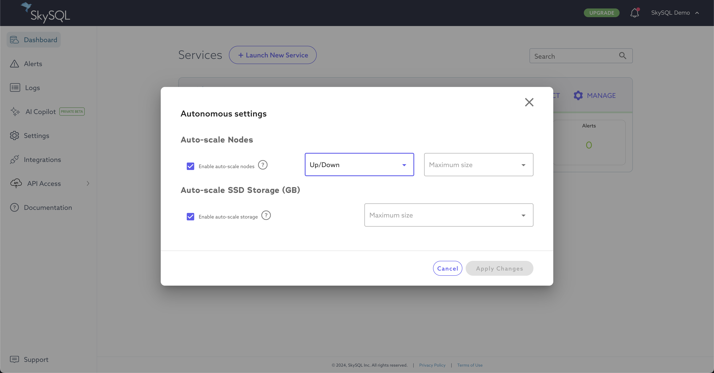

# Autonomously scale Compute, Storage

Autonomous features enable automatic scaling in response to changes in workload.

Auto-scale of nodes enables scaling based on load:

- In/Out auto-scaling performs horizontal scaling, decreasing (In) or increasing (Out) the node count.
- Up/Down auto-scaling performs vertical scaling, increasing (Up) or decreasing (Down) the instance size.

Auto-scale of storage enables expansion of capacity based on usage.

Autonomous features can be enabled at time of [service launch](<../Portal features/Launch page.md>).
Autonomous features can be enabled or disabled after launch.

## Enable Auto-Scaling of Nodes

Auto-scaling of nodes can be enabled either at time of service launch or after service launch.

During [service launch](<../Portal features/Launch page.md>):

- Check the "Enable auto-scale nodes" checkbox and set the desired scaling parameters.

After service launch, [manage Autonomous settings](#manage-autonomous-settings), and enable the desired auto-scaling features.

## Enable Auto-Scaling of Storage

Auto-scaling of storage can be enabled either at time of service launch or after service launch.

During [Service Launch](<../Portal features/Launch page.md>):

- Check the "Enable auto-scale storage" checkbox and set the desired maximum transactional data storage.

After service launch, [manage Autonomous settings](#manage-autonomous-settings), and enable the desired auto-scaling features.

## Manage Autonomous Settings

To manage Autonomous settings:

- From the [Portal](<../Portal features/>), click the "MANAGE" button for the desired service,
    then choose "Autonomous" from the menu.
- Update settings as desired.
- Click "Apply Changes" when complete.

## Scaling Rules

Automatic scaling occurs based on rules.

| Policy                | Condition | Action |
|-----------------------|-----------|--------|
| Auto-Scale Disk       | <ul><li>Disk utilization > 90% sustained for 5 minutes.</li><li>The disk is expected to run out of capacity in the next 24 hours (predicted based on the last 6 hours of service usage).</li></ul> | Upgrade storage to the next available size in 100GB increments. You cannot downgrade storage, the upgrade is irreversible. |
| Auto-Scale Nodes Out  | <ul><li>CPU utilization > 75% over all replicas sustained for 30 minutes.</li><li>Number of concurrent sessions > 90% over all replicas sustained for 1 hour.</li><li>Number of concurrent sessions is expected to hit the maximum within 4 hours (predicted based on the last 2 hours of service usage).</li></ul> | Add new replica or node. Additional nodes will be of the same size and configuration as existing nodes. |
| Auto-Scale Nodes In   | <ul><li>CPU utilization < 50% over all replicas sustained for 1 hour.</li><li>Number of concurrent sessions < 50% over all replicas sustained for 1 hour.</li></ul> | Remove replica or node. Node count will not decrease below the initial count set at launch. |
| Auto-Scale Nodes Up   | <ul><li>Number of concurrent sessions is expected to hit the maximum within 4 hours (predicted based on the last 2 hours of service usage).</li></ul> | Upgrade all nodes to the next available size. |
| Auto-Scale Nodes Down | <ul><li>CPU utilization < 50% over all replicas sustained for 1 hour.</li><li>Number of concurrent sessions < 50% over all replicas sustained for 1 hour.</li></ul> | Downgrade nodes. Node size will not decrease below the initial node size set at launch. |

Autonomous actions are not instantaneous.

Cooldown periods may apply. A cooldown period is the time period after a scaling operation is completed
and before another scaling operation can occur. The cooldown period for storage scaling is 6 hours.
