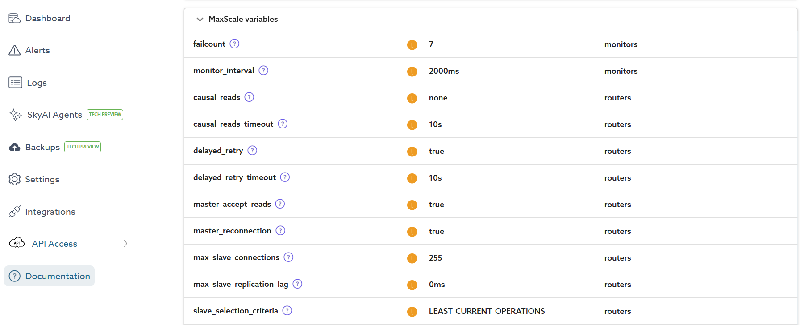

# Higher Availability and Disaster Recovery Concepts

!!! Note
    SkySQL provides HA using semi-synchronous replicas. Unlike hyperscalers these replicas are not standy DB servers but actively used for Reads. When the primary crashes our intelligent proxy allows us to failover near instantly to an alternate replica. Or, failback when the original primary recovers. Ensuring data consistency even when replicas have a replication lag through “causal reads”, or transaction replay. 

----

## **Use 'Replicated Topology' for HA**

For HA and Load balancing client requests there is no configuration required. Just launch a `replicated topology` DB service. SkySQL automatically starts an intelligent proxy that does all the heavy lifting. Detecting failures and replaying transactions, awareness of who the primary is at all times, balancing load and much more. 

You should be aware of the `causal_reads` configuration as outlined below. The sections below provide a more detailed description of how SkySQL delivers on HA and scaling across replicas. 

## **Level 1 Resiliency - container health checks, compute-storage isolation**

To provide high resiliency we try to protect every layer of the stack – disks, compute, Zones/cloud regions, network and even the load balancer accepting incoming DB connections. The graphic below depicts this architecture. Letʼs peel the onion a bit.

All Cloud databases configured for HA replicate the data across multiple availability zones (AZ). Ensuring your data is protected against data center failures. This is necessary, but not sufficient. In SkySQL, data is always isolated from compute on the underlying block storage device of each AZ. This device keeps a copy of each block on multiple servers providing the first layer of protection against component failures or corruption.

The deployment of DB servers occurs within containers orchestrated by Kubernetes (k8s). In the event of cloud instance failures, SkySQL’s health monitoring prompts k8s to revive the container in an alternate instance, seamlessly reconnecting to the same storage volume. AWS RDS, for example, runs MariaDB on VMs requiring a replicated setup for any protection against node failures.

## **Level 2 Resiliency - Failover using Intelligent proxy**

While hardware failures are a possibility, a more common scenario we see in practice involves a DB crash due to resource exhaustion or timeouts—such as running out of allocated temp space due to rogue queries or an unplanned large spike in data load. In such instances, it is crucial for application connections to smoothly transition to an alternate server.

Behind the scenes, SkySQL consistently directs SQL through its intelligent proxy. This proxy not only continuously monitors servers for failures but also remains acutely aware of any replication lags in the replica servers. Should a primary server fail, an immediate election process ensues to select a replica with the least lag. Simultaneously, attempts are made to flush any pending events, ensuring synchronization and full data consistency. Any pending transactions on the primary server are also replayed. Collectively, these measures enable applications to operate without connection-level interruptions or SQL exceptions. Achieving heightened levels of High Availability (HA) is effortlessly attainable by expanding the number of replicas. Replication can even extend across different cloud providers or to a self-managed (ˮpeace of mindˮ) replica within a customerʼs own environment.

    
*HA in a single region*

## **Scaling Concurrent Users without Compromising Consistency**

Cloud offerings of open source relational databases often achieve scalability by distributing data across a cluster of nodes, often relying on a replication model where ‘writes’ to the primary node are asynchronously transmitted to one or more replicas. Typically, the onus is on the customer to manage the distribution of traffic across the cluster, either through client application logic or by configuring a proxy service. Several customers have told us that this is simply too big a challenge, effectively capping the scalability of these cloud solutions. Even when customers successfully navigate this challenge, with this approach data consistency might not be uniform across the entire cluster at any given moment.

When application client connections are evenly load balanced across these replicas for ‘reads,’ the application must either tolerate potentially stale reads or consistently direct all requests to the primary, severely limiting scalability. Replicas are relegated to offline tasks like reporting — a common scenario from our observations in AWS RDS.

Contrastingly, in SkySQL, the intelligent proxy provides consistency options without compromising its ability to load balance requests across replicas, supporting both ‘causal’ and ‘strong, global’ consistency models. Let’s delve deeper.

Causal consistency ensures that ‘reads’ are fresh only concerning the writes they are causally dependent on. For instance, when an app client executes a ‘write’ followed by a ‘read,’ it expects to see the changed value, causally dependent on the preceding ‘write.’ This sequence may need to be satisfied exclusively by the primary if the replicas lag behind. Concurrent clients, however, continue to be load balanced across all servers.

This model functions optimally when application clients utilize sticky SQL connections. However, in the modern landscape where applications are often distributed (micro services) and rely on connection pooling frameworks, a ‘write’ and the subsequent ‘read’ might occur on different connections. To ensure consistent reads, awareness of the ‘lag’ at a global level is imperative. Fortunately, this is seamlessly achieved with a simple switch in SkySQL. If the ‘write’ rate is moderate and the replicas can keep up (a prevalent scenario in practice), clients continue to uniformly utilize the entire cluster.

### Configuring Causal Read in SkySQL 
Causal consistency is configured in the SkySQL [Configuration Manager](https://app.skysql.com/settings/configuration-manager), under Maxscale Variables (applies to Replicated clusters only). Search for [causal reads](https://mariadb.com/kb/en/mariadb-maxscale-2208-readwritesplit/#causal_reads).

> [!IMPORTANT]
> We do not advise adjusting `causal_reads` unless absolutely necessary.
> Adjust the [max_slave_replication_lag](https://mariadb.com/kb/en/mariadb-maxscale-2208-readwritesplit/#max_slave_replication_lag), which determines the max lag > for any read. The load balancer will only routes to slaves with a lag less than this value. By default, this is unbounded.
> Make sure none of the replicas ever cross 70-80% CPU in a sustained manner.

In general, if the application is not performing large transactions or batch writes, given our default semi-sync replication, the replica SQL threads will keep up - i.e. getting an inconsistent read is unlikely.

Our replication model is fast as it is configured to be parallel and optimistic - on the replica multiple SQL threads process incoming writes concurrently. It is designed to detect conflicts and revert to proper sequencing, thus being transparent to the app and ensuring consistency.

* Set [causal_reads](https://mariadb.com/kb/en/mariadb-maxscale-2208-readwritesplit/#causal_reads) to 'local' to achieve consistency at a connection/session level.
     * We recommend first exploring to see if `causal_reads` set to `local` will suffice. This is quite fast (minimal to no tradeoff) and ensures read consistency at a connection/session level. If the app is using a connection pool, it is important to understand how it is being used.
     * Example: A banking app lets a user transfer $100 between accounts in a single session. The app writes the debit and credit, then reads the updated balances to show the user. The connection pool reuses the same session for the transaction and follow-up read. Replica lag is 500ms, but semi-sync replication and parallel SQL threads keep it minimal. The write (debit $100, credit $100) is committed on the primary. Within the same session, the read on the replica waits for the write to be applied (up to 500ms), then returns the correct balances.
* Set [causal_reads](https://mariadb.com/kb/en/mariadb-maxscale-2208-readwritesplit/#causal_reads) to 'global' for strict consistency across all connections.
     * If global read consistency is a must, first try `global`. To use this, you will also need to tune the [causal_reads_timeout](https://mariadb.com/kb/en/mariadb-maxscale-2208-readwritesplit/#causal_reads_timeout). Reads will be load balanced, and a reader will wait a max of this timeout before giving up and retrying on the primary node. That is, if the replica is lagging, it will wait for this time to see if the replica catches up.
     * Example: A social media app displays a user’s post immediately after they submit it. Reads are load-balanced across replicas, but one replica is lagging due to a batch write. Assume the setup is causal_read_timeout = 300ms, replica lag is 400ms; primary CPU is at 50%, replicas at 70-80%. User posts a message (write goes to primary). Read is routed to a lagging replica, which waits 300ms for the write to apply but times out (lag > timeout). Query retries on the primary, taking 301ms total instead of the usual 1ms. The takeaway here is that global ensures consistency across all nodes but can degrade performance if replicas lag beyond causal_read_timeout. Tune the timeout and monitor lag carefully.
* Set [causal_reads](https://mariadb.com/kb/en/mariadb-maxscale-2208-readwritesplit/#causal_reads) to 'fast' to achieve consistency at a connection/session level but is faster than 'local' but at the cost of load balancing.
     * If and only if your application is very read heavy, you should consider `fast_global`. This relies on `monitor_interval` (Maxscale tracks each replica once in this interval) to know if the replicas have caught up or are behind. This will likely need to be configured in milliseconds.
     * Example: A real-time analytics dashboard updates every 200ms with new data. The app is read-heavy, querying replicas constantly. The setup is monitor_interval = 300ms (MaxScale polls replicas every 300ms). Writes occur every 200ms; replicas lag by 100-200ms. A write updates the data at T=0ms. At T=200ms, a read hits a replica. MaxScale’s last poll (T=-100ms) shows the replica as caught up, but it’s now behind by 200ms. The read returns stale data because monitor_interval > write frequency. All traffic shifts to the primary since replicas can’t keep up reliably. The takeaway is that fast_global works for read-heavy apps only if monitor_interval is tuned lower than the write frequency (e.g., 100ms here), but it risks routing all traffic to the primary if misconfigured.

### **Increased throughput using Active-Active**

Unlike RDS or GCP, where the standby is not used for client requests (wasting resources), SkySQL maximizes the available compute power across all nodes, delivering unparalleled cost effectiveness.

A notable feature enhancing performance is the ‘Read-Write Splitting,’ allowing for custom routing to achieve consistently lower latencies for specific application patterns. For example, point queries and index-optimized queries can be directed to select nodes hosting frequently accessed data, while more resource-intensive scan-aggregation class queries (such as those for reporting dashboards or complex queries based on end-user selections of historical data) can be routed to a separate set of nodes. These routing strategies effectively segment actively used data sets, optimizing the DB buffer cache and resulting in lower latencies.

The implementation of these routing strategies is straightforward, primarily through the use of “Hint Filters.” Standard SQL comments are utilized to customize routing to the appropriate server. Additional details on Hint Filters and Read-Write Splitting can be found in the MariaDB documentation.

In SkySQL you can control routing using 2 strategies:

- Using the `read port` for the service: Typically this will be port 3307. When using this port the request (read_only) will be load balanced only across the available replicas. 
- Using the [Hintfilter](https://mariadb.com/kb/en/mariadb-maxscale-24-hintfilter/)  (TODO: provide detailed example using SkySQL node names)

## **Level 3 Resiliency -  Disaster Recovery – Across Regions, Cloud Providers, or “Self-managed” Environments**

!!! Note
    Please refer to [this](Setup%20Global%20Replication.md) document for the steps to setup a distant replica for DR. 

The major cloud providers tout disaster recover across regions, ensuring resilience against natural disasters impacting an entire geographical region. But in reality, such disasters are exceedingly rare. Whatʼs far more common are technical issues impacting an entire region for a specific cloud provider. For instance, we’ve encountered DNS-level failures in GCP regions, rendering all services dependent on DNS, including SkySQL, inaccessible.

One effective strategy to mitigate such risks is to replicate data to a data center owned by a different cloud provider within the same geographical area, minimizing network latencies. Disaster recovery across cloud providers is of course something an individual provider such as AWS or GCP simply donʼt support. Alternatively, customers can maintain their own “standby” database for emergencies—an environment entirely under their control, ensuring a near-real time copy of the data at all times.

    
*Failover when entire region becomes unavailable*

SkySQL empowers users to configure “external” replicas that can run anywhere, offering flexibility and resilience.

To facilitate this, SkySQL provides several built-in stored procedures for configuring both “outbound” and “inbound” replication to any compatible MariaDB or MySQL server environment. This flexibility allows users to tailor their disaster recovery strategy based on their specific needs, whether replicating across regions, cloud providers, or maintaining self-managed standby environments.
