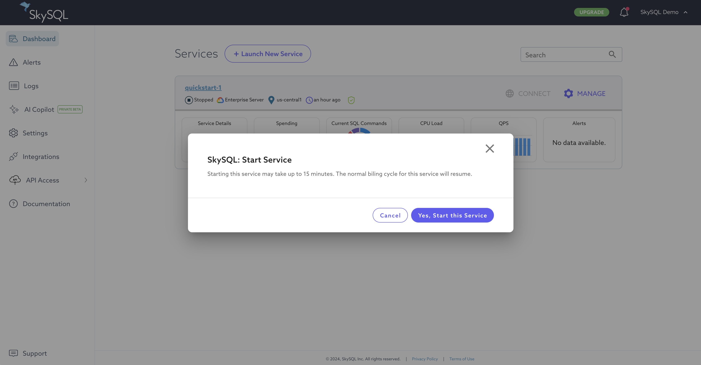
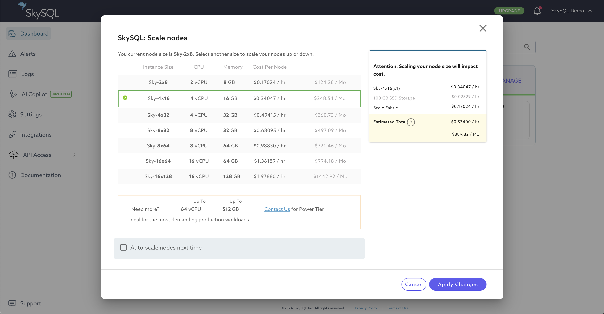
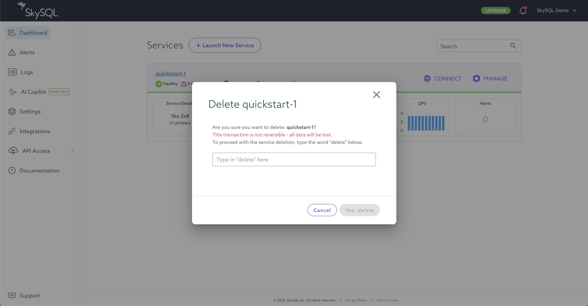

# Manage your Service

SkySQL's self-service management features enable authorized accounts to launch cloud databases, start and stop cloud databases, delete cloud databases, apply database configuration changes, and configure the cloud database's IP firewall.

Self-service [user management](<../Security/Managing Portal Users.md>) features enable you to define role-based access for your team to jointly manage SkySQL resources.

# Stop a Service

*Stop Service*

To stop a service:

1. Log in to the [Portal](https://app.skysql.com/dashboard).
2. Click the `MANAGE` button (at right) for the desired service.
3. Choose the "Stop Service" menu item.
4. Click the "Yes, Stop this service" button to confirm this operation.

The service will be stopped. You will only be charged for storage on a stopped service.

[Notifications](./Notifications.md) will be generated when this operation is initiated and when the operation is performed.

# Start a Service

*Start Service*

To start a service:

1. Log in to the [Portal](https://app.skysql.com/dashboard).
2. Click the "MANAGE" button (at right) for the desired service.
3. Choose the "Start Service" menu item.
4. Click the "Yes, Start this service" button to confirm this operation.

The service will be started. Service start may take up to 10-15 minutes. The normal billing cycle for the service will resume.

[Notifications](./Notifications.md) will be generated when this operation is initiated and when the operation is performed.

# Scale Nodes In/Out

*Service - Horizontal Scaling*

Horizontal scaling is performed by scaling nodes In (reducing node count) or Out (increasing node count).

To scale nodes horizontally:

1. Log in to the [Portal](https://app.skysql.com/dashboard).
2. Identify the service you want to scale. Services must be in a "Healthy" state to scale.
3. Click the "MANAGE" button (at right) for the desired service.
4. Choose the "Scale nodes in/out" menu item.
5. Change the node count to the desired value.
6. Optionally, you can check the "Auto-scale nodes horizontally" checkbox to enable [Autonomous](<../../Autonomously scale Compute, Storage/>) features for this service.
7. Click the "Apply Changes" button.

The service immediately goes into scaling status.

[Notifications](./Notifications.md) will be generated when this operation is initiated and when the operation is performed.

# Scale Nodes Up/Down

*Service - Vertical Scaling*

Vertical scaling is performed by scaling nodes Up (increasing node size) or Down (decreasing node size).

To scale nodes vertically:

1. Log in to the [Portal](https://app.skysql.com/dashboard).
2. Identify the service you want to scale. Services must be in a "Healthy" state to scale.
3. Click the "MANAGE" button (at right) for the desired service.
4. Choose the "Scale nodes up/down" menu item.
5. Change the node count to the desired value.
6. Optionally, you can check the "Auto-scale nodes vertically" checkbox to enable [Autonomous](<../../Autonomously scale Compute, Storage/>) features for this service.
7. Click the "Apply Changes" button.

The service immediately goes into scaling status.

[Notifications](./Notifications.md) will be generated when this operation is initiated and when the operation is performed.

# Scale Storage

*Service - Scale Storage*

To expand block storage capacity:

1. Log in to the [Portal](ttps://app.skysql.com/dashboard).
2. Identify the service you want to scale. Services must be in a "Healthy" state to scale.
3. Click the "MANAGE" button (at right) for the desired service.
4. Choose the "Scale storage" menu item.
5. Use the slider to select the desired amount of storage.
6. Click the "Apply Changes" button.

Storage scaling is subject to a 6 hour cooldown period.

Storage upgrades are not reversible.

# Delete a Service

*Service - Delete*

To delete a service:

1. Log in to the [Portal](ttps://app.skysql.com/dashboard).
2. Identify the service you want to delete.
3. Click the "MANAGE" button (at right) for that service.
4. Choose the "Delete Service" menu item.
5. Read the warning and follow the provided instructions to confirm your delete operation.
6. Click "Yes, delete".

Your service and all its data will be deleted. This operation is non-reversible.

[Notifications](./Notifications.md) will be generated when this operation is initiated and when the operation is performed.

# Other Self-Service Operations

- [Service Launch](<./Launch page.md>)
- [Firewall Management](<../Security/Configuring Firewall.md>)
- [Configuration Management](<../config/>)
- Private Connections:
    - [AWS PrivateLink](<../Using AWS Azure GCP private VPC connections/Setting up AWS Private Link.md>)
    - [GCP Private Service Connect](<../Using AWS Azure GCP private VPC connections/Setting up GCP Private Service Connect.md>)
- [User Management](<../Security/Managing Portal Users.md>)
