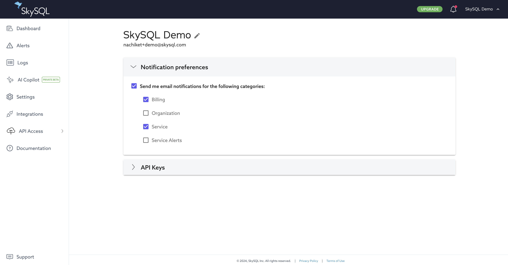
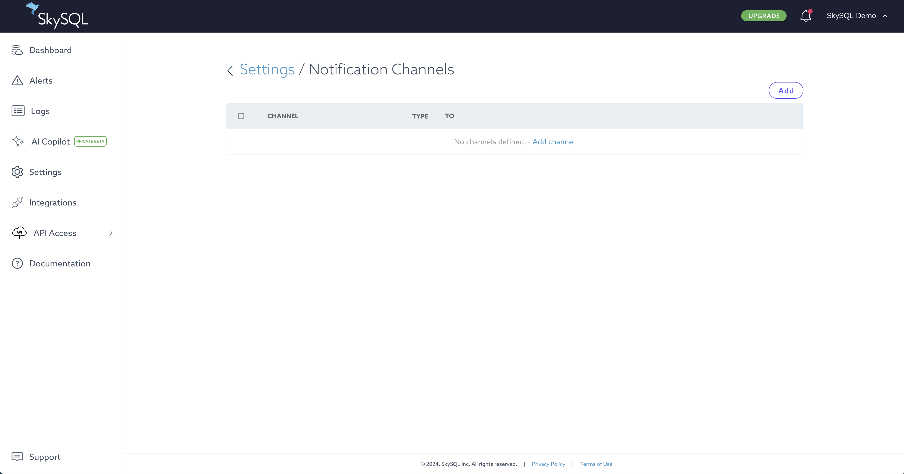
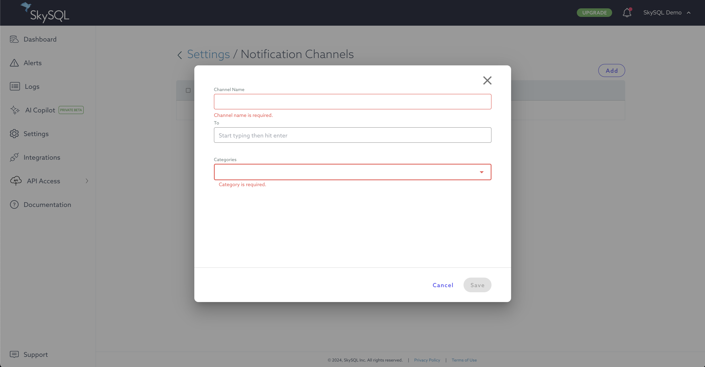

# Notifications

Actions performed through the Portal will generate a notification.

One notification is generated when an action is initiated.

Additional notifications are generated to convey status as the action is carried out by the system.

# Access to Notifications

To access current notifications:

1. Log in to the [Portal](https://app.skysql.com/dashboard).
2. Click the bell icon in the upper-right corner of the interface.

A menu of recent notifications will be displayed.

The bell icon will include a red dot indicator when a new notification is present. This indicator can be cleared by clicking the "Clear all" link.

*Notifications*

To view historical notifications, click the "View more" link at the bottom of the menu. When viewing historical notifications, notifications can be filtered by category and time frame.

*Notifications - current and historical*

# Notification Categories

- Service Alerts, which are based on `Alerts`
- Billing
- Service, which are based on [Portal](https://app.skysql.com/dashboard) actions
- Organization

# User Preferences

You can configure the notifications delivered to your email address from User Preferences.

To access User Preferences:

1. Log in to the [Portal](https://app.skysql.com/dashboard).
2. Click your name in the upper-right corner of the interface.
3. Choose `Profile`.
4. Click to expand `Notification preferences` section.

From User Preferences you can specify your notification preferences:

- Whether to send notifications to you by email
- Which Notification Categories you want to be sent

*User Preferences*

# Notification Channels

In addition to display in the Portal, notifications can also be delivered by email.

Notification Channels define who receives what type of notifications.

To access Notification Channel settings:

1. Log in to the [Portal](https://app.skysql.com/dashboard).
2. Click the "Settings" link in the main menu (left navigation in the Portal).
3. Click the "Notification Channel" button.

*Notification Channels*

### **Add a Notification Channel**

To add a Notification Channel, from the Notification Channel settings interface:

1. Click the "Add" button in the upper-right corner.
2. Enter a channel name.
3. Enter the email address that will receive notifications.
4. Choose the notification categories that should be sent to that address.

*Notification Channels - Adding a Channel*

### **Remove a Notification Channel**

To remove a Notification Channel, from the Notification Channel settings interface:

1. Check the checkbox to the left of the notification channel to be removed.
2. Click the "Delete" button (which appears when a notification channel is selected by checkbox).
3. Confirm removal of the notification channel by clicking the "Yes, delete" button.

### **Edit a Notification Channel**

To modify a Notification Channel, from the Notification Channel settings interface:

1. Click the name of the channel to modify.
2. Make the desired changes to the channel name, email address recipient list, and notification categories.
3. Click the "Save" button.