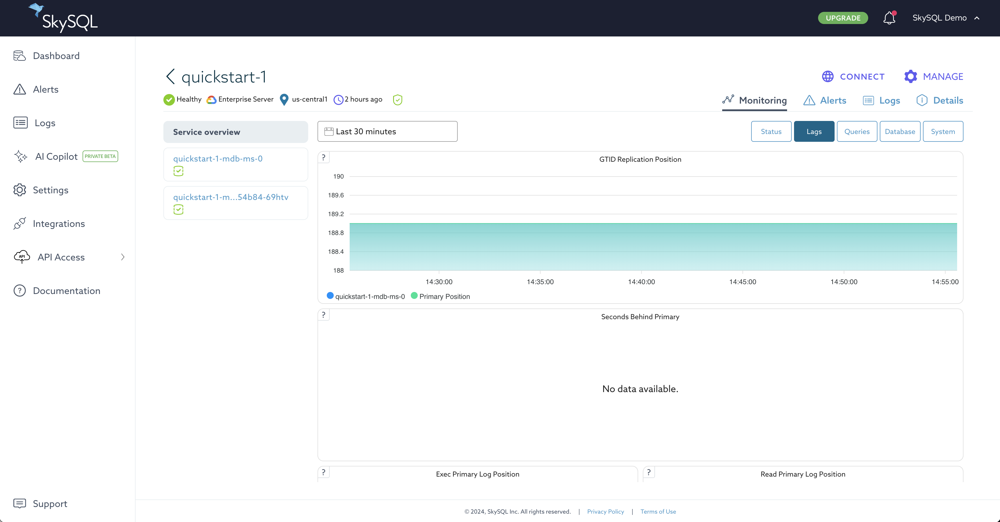
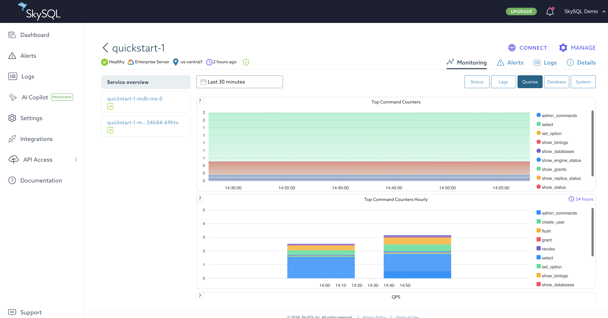
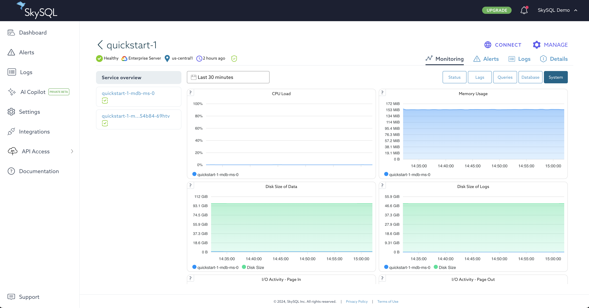

# Service Monitoring Panels

The available panels are :

*Monitoring page*

## Current SQL Commands (service)

This panel shows the ratio between the types of SQL statements executed by the service during the selected time interval.

## CPU Load (service,status)

This panel shows the CPU usage for each server node during the selected time interval.

## QPS (service,status)

This panel shows the queries per second (QPS) executed by the server node during the selected time interval.

## Connections (service)

This panel shows the number of used and aborted connections for each ES node along with the max_connections value.

## Replicas status

This panel shows summarized values for certain replication-related metadata to help determine if any replica ES nodes encountered replication issues during the selected time interval.

## Replicas lags

This panel shows average values for certain replication-related metadata to help determine if the replica ES nodes are currently lagging behind the primary ES node.

## Disk Size of Data

This panel shows the amount of storage space used (as the usage percentage, actual size, and total size) by each server node.

## Disk Size of Logs

This panel shows the amount of storage space used by each server node during the selected time interval.

## GTID Replication Position (service,replicas)

This panel shows the Global Transaction ID (GTID) for each ES node during the selected time interval.

## Seconds Behind Primary

This panel shows the average number of seconds that the replica ES nodes lagged behind the primary ES node during the selected time interval.

## Exec Primary Log Position

This panel shows the current binary log position of the replica SQL thread for each ES node during the selected time interval.

## Read Primary Log Position

This panel shows the current binary log position of the replica I/O thread for each ES node during the selected time interval.

## Top Command Counters (service,queries)

This panel shows the top 30 statement types that were most frequently executed by all ES nodes during the selected time interval.

## Top Command Counters (server)

This panel shows the top 30 statement types that were most frequently executed by the ES node during the selected time interval.

## Top Command Counters Hourly (service)

This panel shows the top 30 statement types that were most frequently executed by all ES and Xpand nodes in 1 hour intervals over the past 24 hours.

## Top Command Counters Hourly (server)

This panel shows the top 30 statement types that were most frequently executed by the ES node in 1 hour intervals over the past 24 hours.

## MariaDB QPS

This panel shows the number of queries per second (QPS) executed by all ES nodes during the selected time interval.

## MariaDB Slow Queries (service,queries)

This panel shows the number of slow queries executed by all ES nodes during the selected time interval.

## MariaDB Slow Queries (server)

This panel shows the number of slow queries executed by the ES node during the selected time interval.

## MariaDB QPS and Questions

This panel shows the number of queries and questions per second executed by the ES node during the selected time interval.

## MariaDB Client Thread Activity (service)

This panel shows the number of client threads running on all ES nodes during the selected time interval.

## MariaDB Client Thread Activity (server)

This panel shows the number of client threads connected and running on the ES node during the selected time interval.

## MaxScale Service Connections

This panel shows the number of clients connected to all MaxScale nodes during the selected time interval.

## MaxScale Server Connections

This panel shows the number of client connections open between the MaxScale node and each ES node during the selected time interval.

## MariaDB Service Connections

This panel shows the number of clients connected to the ES node during the selected time interval.

## MariaDB Aborted Connections

This panel shows the number of connections aborted by the ES node during the selected time interval.

## MariaDB Table Locks (service)

This panel shows the number of table locks requested by all ES nodes during the selected time interval.

## MariaDB Table Locks (server)

This panel shows the number of table locks requested by the ES node during the selected time interval.

## MariaDB Open Tables (service)

This panel shows the number of tables opened by the database servers on all ES nodes during the selected time interval.

## MariaDB Open Tables (server)

This panel shows the number of tables opened by the database server on the ES node during the selected time interval.

## MariaDB Table Opened

This panel shows the number of tables that have been opened by all ES nodes during the selected time interval.

## CPU Load

This panel shows the CPU usage for each server node during the selected time interval.

## Memory Usage

This panel shows memory usage details for all ES nodes during the selected time interval.

## I/O Activity - Page In

This panel shows the total number of bytes read from the ES node's file system during the selected time interval.

## I/O Activity - Page Out

This panel shows the total number of bytes written to the ES node's file system during the selected time interval.

## I/O Activity (server,system)

This panel shows the total number of bytes written to or read from the ES node's file system during the selected time interval.

## IOPS

This panel shows the number of input/output operations per second performed by the ES node during the selected time interval.

## IOPS - Page In

This panel shows the total number of reads performed from the ES node's file system during the selected time interval.

## IOPS - Page Out

This panel shows the total number of writes performed from the ES node's file system during the selected time interval.

## Network Traffic - Inbound

This panel shows the amount of data received over the network by the operating systems on all ES nodes during the selected time interval.

## Network Traffic - Outbound

This panel shows the amount of data sent over the network by the operating systems on all ES nodes during the selected time interval.

## MariaDB Network Traffic (service)

This panel shows the amount of data sent and received over the network by the database servers on all ES nodes during the selected time interval.

## MariaDB Network Traffic (server)

This panel shows the amount of data sent and received over the network by the database server on the ES node during the selected time interval.

## Network Traffic (server,status)

This panel shows the amount of data sent and received over the network by the operating system on the ES node during the selected time interval.

## MariaDB Network Usage Hourly (service)

This panel shows the amount of data sent and received over the network per hour by the database servers on all ES nodes over the past 24 hours.

## MariaDB Network Usage Hourly (server)

This panel shows the amount of data sent and received over the network per hour by the database server on the ES node over the past 24 hours.

## Network Errors (service)

This panel shows the number of network errors encountered by all ES nodes during the selected time interval.

## Network Errors (server)

This panel shows the number of network errors encountered by the ES node during the selected time interval.

## Network Packets Dropped (service)

This panel shows the number of network packets dropped by all ES nodes during the selected time interval.

## Network Packets Dropped (server)

This panel shows the number of network packets dropped by the ES node during the selected time interval.

## CPU (server,status,gauge)

This panel shows the current CPU usage for the ES or Xpand node.

## RAM (server,status)

This panel shows the current memory usage details for the ES or Xpand node.

## RAM (server,status,graph)

This panel shows memory usage details for the ES or Xpand node during the selected time interval.

## Buffer Pool Size of Total RAM

This panel shows the current size of the InnoDB buffer pool for the ES node in two units: the absolute size and the percentage of the server's usable memory.

## Used Connections

This panel shows the current number of client connections as a percentage of the ES node's max_connections value.

## InnoDB Data / sec (server,status)

This panel shows the number of bytes per second read and written by InnoDB during the selected time interval.

## Rows / sec

This panel shows the total number of rows written and read per second by the ES node during the selected time interval.

## MariaDB Connections

This panel shows the number of client connections to the ES node during the selected time interval.

## MariaDB Opened Files / sec

This panel shows the number of files opened per second by the database server on the ES node during the selected time interval.

## MariaDB Open Files

This panel shows the number of files opened by the database server on the ES node during the selected time interval.

## MariaDB Transaction Handlers / sec

This panel shows the number of transaction-related handlers created by the ES node during the selected time interval.

## Temporary Objects Created

This panel shows the number of temporary tables created by the ES node during the selected time interval.

## MariaDB Thread Cache

This panel shows the number of threads created and cached for re-use on the ES node during the selected time interval.

## MariaDB Table Open Cache Status

This panel shows the activity of the table open cache on the ES node during the selected time interval.

## MariaDB Table Definition Cache

This panel shows how many table definitions were cached by the ES node during the selected time interval.

## Memory Distribution

This panel shows memory usage details for the ES node during the selected time interval.

## MariaDB Memory Overview

This panel shows how much memory the ES node used for the InnoDB buffer pool, InnoDB log buffer, MyISAM key buffer, and query cache during the selected time interval.

## Memory (server,performance)

This panel shows memory usage details for the MaxScale node during the selected time interval.

## RW/sec (server,cluster)

This panel shows the number of read and write operations per second that were handled by the threads on the MaxScale node during the selected time interval.

## Threads

This panel shows the number of threads currently used by the MaxScale node.

## MaxScale Modules

This panel lists the modules installed on the MaxScale node.

## MaxScale Hangups (server,performance)

This panel shows the number of client connections closed by the MaxScale node during the selected time interval.

## Errors (server,performance)

This panel shows the number of errors encountered by threads on the MaxScale node during the selected time interval.

## Event Queue Length (server,performance)

This panel shows the total event queue length for all threads on the MaxScale node during the selected time interval.

## MaxScale Descriptors (server,cluster)

This panel shows the number of descriptors used by the MaxScale node during the selected time interval.

## Max Time in Queue (server,cluster)

This panel shows the longest time the MaxScale node waited for an I/O event during the selected time interval.

## MaxScale Connections

This panel shows the number of clients connected to the MaxScale node during the selected time interval.

## Database Server Connections

This panel shows the number of database server connections open between the MaxScale node and each ES or Xpand node during the selected time interval.

## Resident (server,cluster)

This panel shows the current resident set size (RSS) of the MaxScale process.

## Stack size (server,cluster)

This panel shows the current stack size of the MaxScale node.

