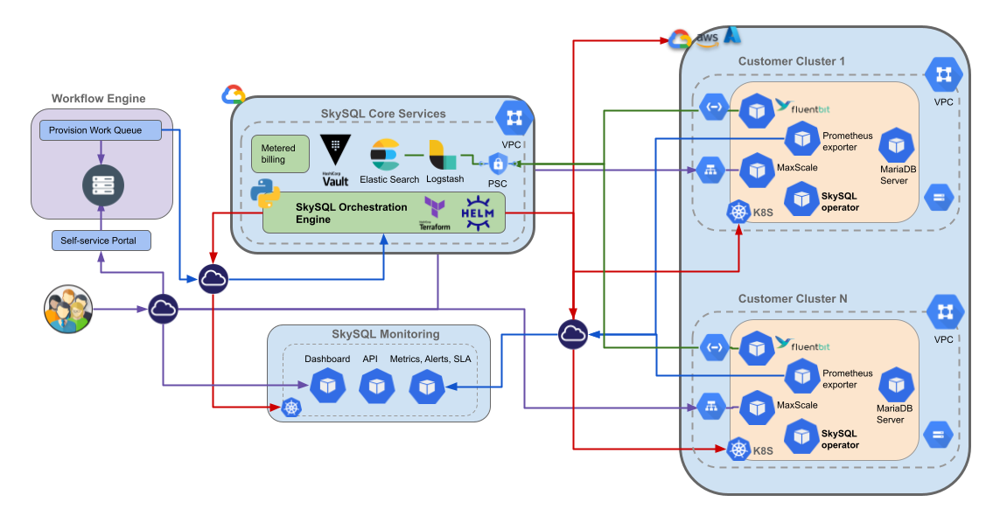

# SkySQL Architecture

The SkySQL architecture is designed to provide a robust, scalable, and secure database management solution. At its core, users interact with the system through the Application Portal, which serves as the interface for deploying and managing database instances. This portal connects to the SkySQL Core Services, a suite of components responsible for handling user requests, orchestrating deployments, and monitoring system performance via RESTful APIs.

The SkySQL Core Services operate within a Virtual Private Cloud (VPC) to ensure security and isolation. Key components within this core include APIs and microservices that manage database operations and user interactions, a monitoring and metrics infrastructure that tracks the health and performance of the databases, and an orchestration engine that deploys and configures database instances as needed.

Customer clusters are deployed in their own VPCs, providing complete security and isolation. Each cluster houses multiple MariaDB server instances managed by Kubernetes, which ensures performance and high availability. This architecture allows SkySQL to seamlessly integrate with major cloud providers like AWS, GCP, and Azure, offering flexible multi-cloud and scalable deployment options to meet varying customer needs.