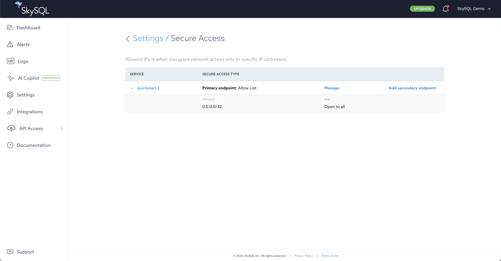

# Configuring Firewall

SkySQL services are firewall-protected.

Access to SkySQL services is managed on a per-service basis.

IPv4 addresses and IPv4 netblocks can be added to the allowlist to enable service access. Access from other addresses will be blocked.

## **Default**

By default, when a service is launched its allowlist is empty. All external traffic to the service is blocked.

## **Secure Access Configuration**

To modify Secure Access settings:

1. Log in to the [Portal](https://app.skysql.com/dashboard).
2. Click the "Settings" link in the main menu (left navigation in the Portal).
3. Click the "Secure Access" button.

*Secure Access Settings*

Alternatively, you can access firewall settings for a specific service by clicking on the "MANAGE" button for the desired service, then choose "Manage allowlist" from the menu.

*Allowlist dialog*

## **Add to the Allowlist**

IP addresses can be added to the allowlist from the Firewall settings interface or a service's Security Access interface:

1. Enter an IPv4 address or IPv4 netblock.
2. Optionally enter an alias for this address. An alias provides a way to remember why an address was added to the allowlist.
3. Click the "Save" button.

After saving the change, a [notification](<../Portal features/Notifications.md>) will be provided when the change has been applied.

## **Remove from the Allowlist**

IP addresses can be removed from the allowlist from the Firewall settings interface or a service's Security Access interface:

1. Click the "X" button to the right of the entry to remove.
2. Click the "Save" button.

After saving the change, a [notification](<../Portal features/Notifications.md>) will be provided when the change has been applied.

## **Edit an Allowlist Entry**

An allowlist entry can be edited from the Firewall settings interface or a service's Security Access interface:

1. Modify the IP address or alias of the desired allowlist entry.
2. Click the "Save" button.

After saving the change, a [notification](<../Portal features/Notifications.md>) will be provided when the change has been applied.

## **IP Allowlist Limitations**

**AWS/Azure Services:**
- Allowlists exceeding 30 IP addresses are not permitted.

**GCP Services:**
- Same workflow as AWS/Azure, but with a limit of 200 IP addresses.

For allowlists requiring more than 30 IP addresses, please contact [support@skysql.com](mailto:support@skysql.com).