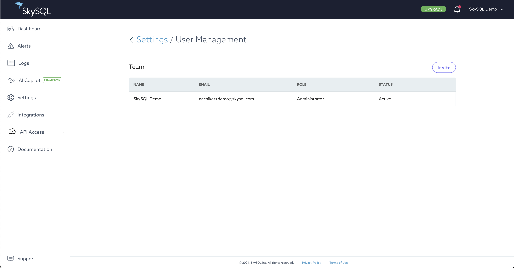

# Managing Portal Users

By default, SkySQL services are launched and managed in the [Portal](<../../Portal features/>).

For multiple SkySQL ID accounts to jointly manage a set of SkySQL services, these accounts can be added to a Team.

The User Management interface in the [Portal](<../../Portal features/>) is a self-service tool to manage your Team.

A Team can be managed by the initial user on the Team or by any Administrator added to the Team.

An email address can belong to only one SkySQL Team. If an email address is already in a Team, it cannot be added to another Team.

## **Access to User Management**

To access the User Management interface:

1. Log in to the [Portal](https://app.skysql.com/dashboard).
2. Click the "Settings" link in the main menu (left navigation in the Portal).
3. Click the [User Management](https://app.skysql.com/settings/user-management) button.

*User Management*

## **Roles**

Each Team member has one of the following roles:

- Administrator
- Member
- Viewer
- Billing

## **Add a Team Member**

*User Management - Invite*

From the User Management interface, an Administrator can invite someone to join a team:

1. Click the "Invite" button in the upper right corner of the User Management interface.
2. Enter the email address of the person to invite to the team.
3. Choose the desired role for this user.
4. Click the "Add User" button.

Once a user has been invited, they will appear in the Team member list in an "Invited" status until the invitation is accepted.

An invitation is delivered by email. The user will be prompted to complete account setup when accepting the invitation.

You can withdraw the invitation before it is accepted by clicking on the "Cancel Invitation" link in the Team member list.

## **Remove a Team Member**

From the User Management interface, an Administrator can remove a team member:

1. Identify the team member to remove.
2. Click the ellipsis icon ("...") on the right side of that user's row.
3. Select the "Deactivate" menu item.
4. Read the displayed warning.
5. Click the "Deactivate" button to complete deactivation.

## **Edit a Role**

From the User Management interface, an Administrator can change a team member's role:

1. Identify the team member to modify.
2. Click the ellipsis icon ("...") on the right side of that user's row.
3. Select the "Edit" menu item.
4. Choose the desired Role for the user.
5. Click the "Save" button to complete the change.