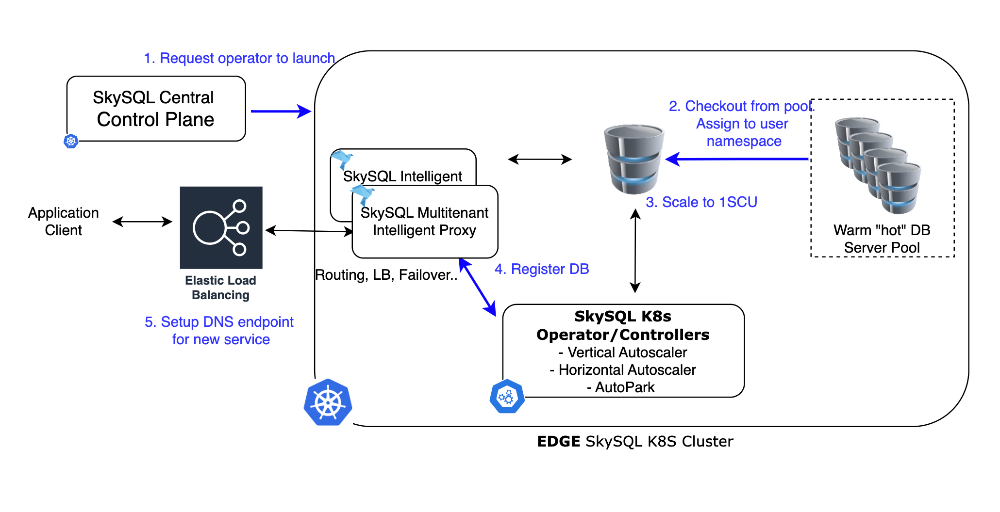

# Serverless Architecture

This document provides a comprehensive technical overview of SkySQL Serverless architecture, explaining how it achieves true serverless capabilities while maintaining full compatibility with MySQL and MariaDB.

## Design Philosophy

SkySQL Serverless is built on the principle: **"Don't change what works"**. Instead of re-architecting the database engine like other cloud providers, SkySQL leverages cloud-native techniques to achieve serverless capabilities while preserving the mature, open-source database engine.

### Core Principles

1. **Preserve Open Source**: Keep the proven InnoDB storage engine intact
2. **Cloud-Native Approach**: Use Kubernetes and containers for orchestration
3. **No Forking**: Maintain full compatibility with existing applications
4. **Transparent Operations**: Scaling and management should be invisible to applications

## High-Level Architecture

[]( ../Serverless/serverless_architecture.png)

## Core Components

### 1. Intelligent Proxy

The multi-tenant proxy is the cornerstone of SkySQL Serverless, providing:

#### Connection Management
- **Always-On Connections**: Maintains application connections even when database scales to zero
- **Connection Pooling**: Efficiently manages database connections behind the scenes
- **Load Balancing**: Distributes requests across available database instances

#### Session State Management
The proxy tracks and preserves:
- System variables: `SET @@session.sort_buffer_size = X`
- User variables: `SET @myvar = 'value'`
- Prepared statements and their definitions
- Transaction isolation levels and other session settings

#### Failover and Recovery
- **Transparent Failover**: Automatically handles database failures
- **Transaction Replay**: Replays partial transactions to ensure data integrity
- **State Recreation**: Re-establishes session state on new connections

### 2. Kubernetes Orchestration

SkySQL extends Kubernetes with custom controllers for database-specific operations:

#### Custom Resource Definitions (CRDs)
- **DatabaseService**: Defines serverless database configurations
- **ScalingPolicy**: Controls auto-scaling behavior and limits
- **BackupSchedule**: Manages automated backup operations

#### Custom Controllers
- **Resource Monitor Controller**: Tracks CPU, memory, and connection metrics
- **Scaling Controller**: Implements vertical and horizontal scaling decisions
- **Migration Controller**: Handles transparent live migrations
- **Pool Controller**: Manages pre-fabricated database pools

### 3. Pre-Fabricated Database Pools

To achieve millisecond launch times, SkySQL maintains pools of ready-to-use databases:

#### Pool Management
- **Regional Distribution**: Pools maintained in all supported regions
- **Dynamic Replenishment**: Pools refilled based on demand patterns
- **Resource Optimization**: Minimal resource allocation for pool databases

#### Database Initialization
When a user requests a database:
1. Check out a database from the appropriate pool
2. Resize according to service configuration
3. Execute security procedures (user creation, endpoint configuration)
4. Update control plane tracking
5. Database ready for use

### 4. Auto-Scaling Engine

SkySQL implements sophisticated auto-scaling across multiple dimensions:

#### Vertical Scaling Algorithm
```
Every 200ms:
  - Sample CPU usage (UsageCoreNanoSeconds)
  - Update 30-second sliding window

Scale-up decision (1-second window):
  - If CPU usage ≥ 90% of allocated budget → Scale up

Scale-down decision (30-second window):
  - If average CPU usage ≤ 20% → Scale down
  - If no active connections for 10s → Scale to 0
```

#### Resource Allocation
- **Granular Scaling**: 0.5 vCPU and 2GB memory increments
- **Dynamic Limits**: Free tier limited to 2 SCUs, paid tiers scale based on configuration
- **Linux cgroups**: Uses cgroupsv2 for precise resource control

## Database States and Lifecycle

### Active State
- **Full Resources**: CPU, memory, and connections allocated based on demand
- **Optimized Cache**: Buffer pool sized and hydrated for current workload
- **Real-time Monitoring**: Continuous performance and resource tracking

### Suspended State
When activity drops to zero:
1. **Scale Down Resources**: Remove active threads, reduce memory allocation
2. **Minimize Buffer Pool**: Reduce to minimum required by InnoDB
3. **Maintain Connections**: Proxy keeps application connections alive
4. **Quick Reactivation**: Instant scale-up when activity resumes

### Parked State  
After extended inactivity (several hours):
1. **Terminate Pod**: Database pod completely removed
2. **Preserve Storage**: Volume remains attached to service
3. **Proxy Management**: Proxy tracks parked state
4. **Automatic Recreation**: Pod recreated when activity resumes

## Buffer Pool Management

The database buffer pool is critical for performance. SkySQL implements intelligent buffer pool management:

### Dynamic Sizing
- **Proportional Scaling**: Buffer pool size adjusted with resource allocation
- **Performance Monitoring**: Track cache hit ratios during scaling operations

### Cache Hydration
When scaling up after a scale-down:
1. **Page Tracking**: Most frequently used pages identified during scale-down
2. **SSD Storage**: Page IDs stored on high-speed SSD storage
3. **Background Loading**: Frequently used pages reloaded into memory
4. **Performance Consistency**: Maintains cache hit ratios across scaling events

### Implementation Details
```sql
-- Buffer pool hydration process
1. Before scale-down: SHOW ENGINE INNODB STATUS → identify hot pages
2. Store page IDs to fast SSD storage
3. During scale-up: Background process fetches pages from disk
4. Asynchronous hydration maintains query performance
```

## Live Migration System

For horizontal scaling, SkySQL implements transparent live migrations:

### Migration Triggers
- **High Watermark**: Migration initiated at ~70% memory utilization
- **Automatic Provisioning**: New instances created if needed
- **Workload Analysis**: Least-used databases migrated first

### Migration Process
1. **Snapshot Creation**: Create database snapshot on target instance
2. **Replication Setup**: Establish replication channel to source
3. **Synchronization**: Wait for replica to catch up
4. **Proxy Redirection**: Transparently redirect connections
5. **Source Cleanup**: Decommission source database

### Zero-Downtime Guarantees
- **Differential Snapshots**: Only changes copied after initial snapshot
- **Connection Preservation**: No application connection drops
- **Session Continuity**: All session state preserved during migration

## Storage Management

### Auto-Scaling Storage
SkySQL monitors and scales storage automatically:

#### Scaling Thresholds
- **Small Volumes** (< 100GB): Scale at 60% capacity
- **Medium Volumes** (100-500GB): Scale at 80% capacity  
- **Large Volumes** (> 500GB): Scale at 95% capacity

#### Implementation
- **Continuous Monitoring**: PersistentVolumeClaim usage tracked
- **Proactive Scaling**: Scaling initiated before capacity exhausted
- **Block Storage Integration**: Currently uses cloud provider block storage (AWS EBS, Azure Disk, Google Persistent Disk)

### Future Storage Innovations
SkySQL is evaluating distributed storage solutions:
- **Ceph/Rook Integration**: Self-managed distributed storage
- **Multi-Cloud Storage**: Storage spanning multiple cloud providers
- **Performance Optimization**: Custom storage optimizations for database workloads

## Security Architecture

### Network Security
- **Private Networking**: Database pods run in private subnets
- **Encryption in Transit**: TLS/SSL for all connections
- **Firewall Integration**: Cloud-native security group integration

### Data Protection
- **Encryption at Rest**: All storage volumes encrypted
- **Key Management**: Integration with cloud provider key management services
- **Access Controls**: Role-based access control (RBAC)

### Isolation
- **Pod-Level Isolation**: Each database runs in isolated Kubernetes pod
- **Network Policies**: Kubernetes network policies for traffic control
- **Resource Isolation**: cgroups ensure resource isolation between databases

## Monitoring and Observability

### Real-Time Metrics
- **Resource Utilization**: CPU, memory, storage, and network metrics
- **Database Performance**: Query performance, connection counts, cache hit ratios
- **Scaling Events**: Auto-scaling decisions and their impact

### Alerting System
- **Proactive Alerts**: Performance degradation warnings
- **Scaling Notifications**: Automatic scaling event notifications
- **Failure Detection**: Immediate alerts for database failures

### Integration
- **Prometheus**: Metrics collection and storage
- **Grafana**: Visualization and dashboards
- **Custom Metrics**: Database-specific performance indicators

### Other Considerations
- **Vendor Lock-in**: SkySQL maintains portability
- **Cost Transparency**: No hidden charges or surprise costs
- **Performance**: Better performance due to no compute-storage disaggregation
- **Compatibility**: Full compatibility with existing applications

## Performance Characteristics

### Scaling Performance
- **Vertical Scaling**: Typically completes in < 5 seconds
- **Horizontal Scaling**: Live migration in < 30 seconds
- **Cold Start**: Database ready in < 100 milliseconds

### Query Performance
- **OLTP Workloads**: Equivalent to provisioned instances
- **Cache Performance**: Maintained through buffer pool hydration
- **Connection Overhead**: Minimal proxy overhead (< 1ms latency)

### Scalability Limits
- **Vertical Scaling**: Up to cloud provider instance limits
- **Horizontal Scaling**: Unlimited through live migration
- **Storage Scaling**: Up to cloud provider storage limits

## Future Enhancements

### Planned Features
1. **Analytics Integration**: On-demand OLAP with DuckDB integration
2. **Global Distribution**: Multi-region database deployment
3. **Advanced AI**: Machine learning-driven optimization
4. **Edge Computing**: Edge database deployments

### Research Areas
- **Quantum-Ready Encryption**: Future-proof security
- **Advanced Caching**: Intelligent cache management algorithms
- **Distributed Consensus**: Enhanced distributed database capabilities

## Best Practices

### Application Design
1. **Connection Pooling**: Use connection pooling in applications
2. **Graceful Degradation**: Handle temporary scaling events
3. **Monitoring Integration**: Implement application-level monitoring

### Performance Optimization
1. **Query Optimization**: Optimize queries for scaling environments
2. **Index Strategy**: Maintain appropriate indexes for workload
3. **Connection Management**: Minimize connection overhead

### Cost Optimization
1. **Workload Analysis**: Understand application usage patterns
2. **Scaling Limits**: Set appropriate scaling limits
3. **Resource Right-Sizing**: Monitor and adjust resource allocation

This architecture enables SkySQL Serverless to provide true serverless capabilities while maintaining the performance, reliability, and compatibility that enterprises require. 