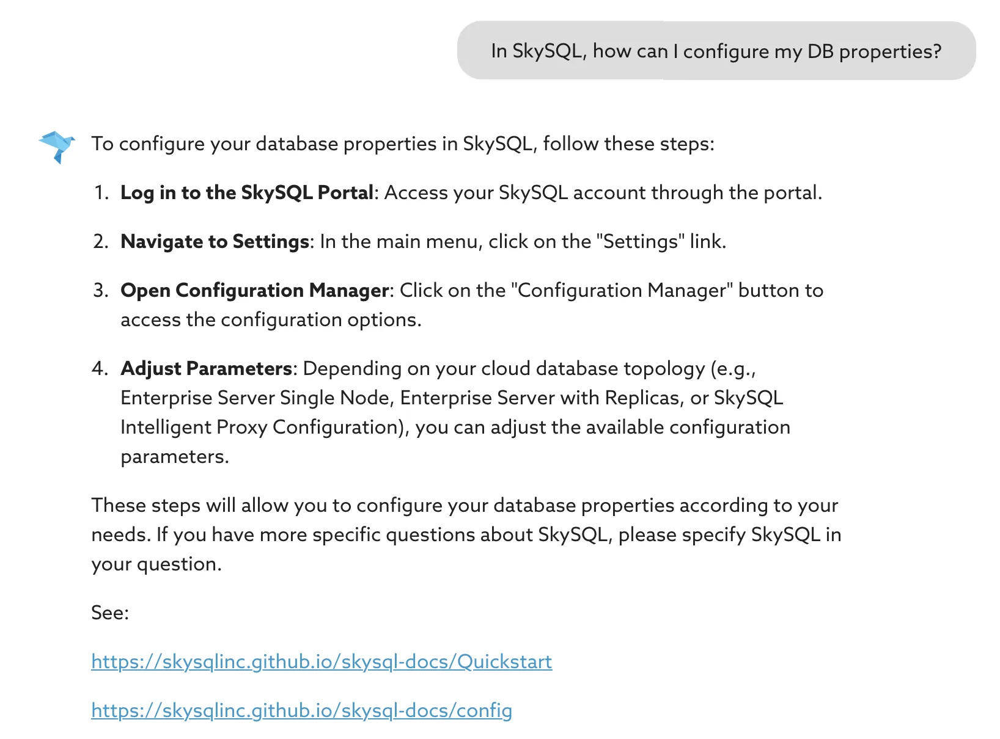

# Semantic AI Agents User Guide (Tech Preview)

!!! Note
    - This capability is currently in Tech Preview.
    - Documentation is terse and incomplete.
    - Currently it is free to use.We provide upto a million tokens of free usage per month per account.
    - Our "free usage" policy is subject to change as we finalize the product.
    
We appreciate your feedback and suggestions. You can reach us at **[info@skysql.com](mailto:info@skysql.com) or [support@skysql.com](mailto:support@skysql.com)**

SkySQL offers two types of Semantic Agents: 

* **Built-in Agents**: These are preconfigured agents designed to help developers and DBAs maximize the value of SkySQL. They assist users in answering questions about MySQL, MariaDB, and SkySQL, and are tailored to enhance user productivity.

* **User-Created Custom Agents**: These allow users to query complex databases using natural language with high accuracy, consistency, and ease.

---
## Built-in Agents

### 1) Developer Copilot **Agent for SQL Developers**

This agent functions much like modern copilot tools but is specifically tailored for **SkySQL** and **MariaDB**. It allows developers to interact with the database using natural language queries, enabling them to quickly find solutions without needing to dive deep into documentation or use SQL editing tools.

You can ask a wide range of questions, such as:

- **General MariaDB Queries**:
    - *"What is the default storage engine in SkySQL?"*
- **SkySQL-Specific Queries**:
    - *"Show me a SkySQL program to connect from Java."*
    - *"In SkySQL, how can I configure my DB properties?"*

Additionally, the agent can generate complex SQL queries spanning multiple tables, create schemas, write integration code, and even assist with tasks like generating stored procedures or loading data. This agent is trained using the **SkySQL documentation** and leverages the **OpenAI LLM's prior knowledge** to provide accurate, context-aware responses.

#### Example of the Developer Copilot in action:

### 2) **DBA Copilot Agent**

The DBA Copilot is a specialized agent that helps DBAs with **system information**, **tuning**, and **diagnostics**. It taps directly into **SkySQL's built-in system tables** and **metadata** to answer queries about the database's internal state.

When a user asks a question, it breaks the query down into discrete steps, each of which typically gets translated into a **SQL statement** targeting system tables such as those in `information_schema`, `mysql`, or `performance_schema`. These steps are executed to fetch relevant data and provide actionable insights, making it easier for DBAs to monitor and optimize database performance.

#### Example of the DBA Copilot in action:

---

## User created custom agents.

### **Semi-Autonomous, No-Code Semantic DB Agents**

SkySQL includes a **No-Code Agent Builder**. This tool empowers domain experts to define the missing semantics critical for accurate responses without requiring programming expertise. The system then leverages the database’s metadata—such as table definitions, constraints, and relationships—and learns from historical queries to train the Agent.

However, automation alone isn’t enough. Real-world databases often contain hundreds of tables with cryptic naming conventions, impure data, and hidden rules. This is where the **human-in-the-loop** design becomes essential. SkySQL engages the user interactively through a wizard-like interface that:

1. Proposes relevant tables and dimensions based on the Agent’s intent.
2. Analyzes data to compute initial semantic descriptions for columns and tables.
3. Allows the user to iteratively refine these semantics.

Users validate and train the Agent by asking questions, inspecting the generated SQL, and tagging “golden SQL” queries that serve as the ground truth. This iterative process ensures the Agent’s outputs are both accurate and contextually relevant.

Under the hood, SkySQL handles:

- **Vector Indexing** of DB metadata, high-cardinality text columns, and golden SQL to enable efficient semantic searches.
- **Automatic Orchestration** of the RAG pipeline, reducing the need for external integrations and securing all AI interactions.
- **Online Evaluation** of the results for accuracy - when dealing with complexity, incomplete guidance or semantics the responses can be inaccurate.  It is important for users or a consuming application to know the quality of the response. We use a “LLM as Judge” approach to provide a confidence and correctness score that is biased against providing false positives. The evaluator is designed to assign lower confidence for uncertain responses rather than risk assigning high confidence to incorrect ones. This approach ensures trustworthy results.

Once trained, the Agent can be consumed via a simple REST API that supports:

- Stateful **Chat Sessions**.
- On-demand **Natural Language Queries**.
- Advanced **Semantic Searches (*coming in the near future*)**.

#### Sky Semantic Agents Architecture

## Using the SkySQL Semantic Agents (coming soon)
