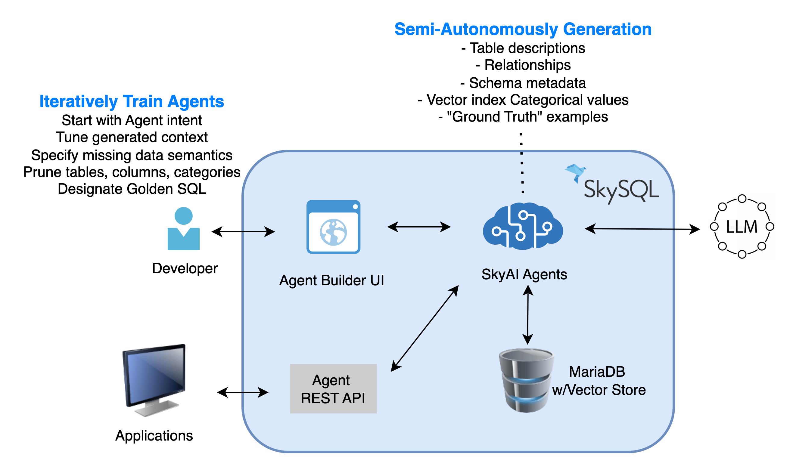
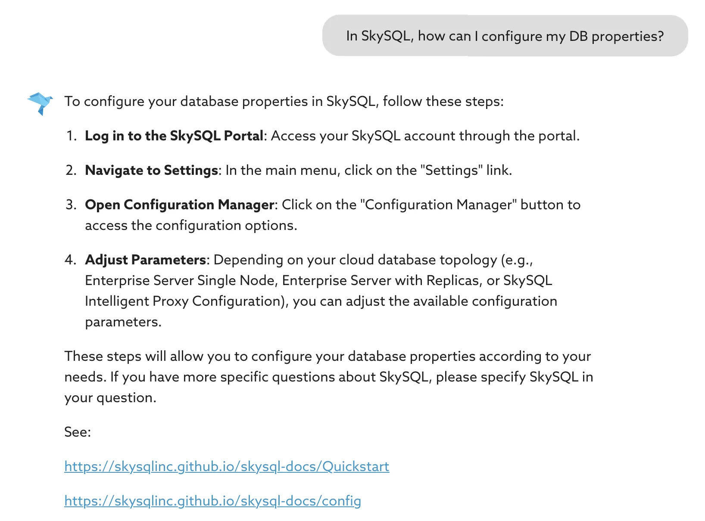
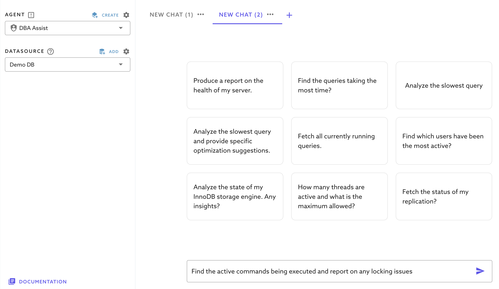

# SkyAI Agents User Guide (Tech Preview)

!!! Note
    - This capability is currently in Tech Preview.
    - Currently it is free to use. 
    - We provide upto a million tokens of free usage per month per account.
    - Our "free usage" policy is subject to change as we finalize the product.
    
We appreciate your feedback and suggestions. You can reach us at **[info@skysql.com](mailto:info@skysql.com) or [support@skysql.com](mailto:support@skysql.com)**

SkySQL offers two types of SkyAI Agents:

  * **Built-in Agents:** These are preconfigured agents designed to help developers and DBAs maximize the value of SkySQL. Currently, we have two agents: Developer Copilot and DBA Copilot. The Developer Copilot assists users in answering questions about MySQL, MariaDB, and SkySQL, in general. The DBA Copilot enables DBA tasks like performance tuning or debugging errors. They are tailored to enhance developer/DBA productivity.
  * **User-Created Custom DB Agents:** These are agents on your schemas/datasets permitting natural language queries over complex databases with high accuracy, consistency, and ease. The databases these agents operate on can be managed within SkySQL or external MySQL or MariaDB DBs.

## Why SkyAI Agents?

Traditional solutions fall short because of:

  * Complex database schemas with multiple layers and relationships.
  * Ambiguous terminology and hidden business rules.
  * Inconsistent data that makes standard AI models inaccurate.

A common approach, Agentic Retrieval-Augmented Generation (RAG), requires extensive data integration and maintenance, making it resource-intensive.

However, automation alone isn't enough. Real-world databases often contain hundreds of tables with cryptic naming conventions, impure data, and hidden rules. This is where the human-in-the-loop design becomes essential. SkySQL engages the user interactively through a wizard-like interface that:

  * Proposes relevant tables and dimensions based on the Agent's intent.
  * Analyzes data to compute initial semantic descriptions for columns and tables.
  * Allows the user to iteratively refine these semantics.

Users validate and train the Agent by asking questions, inspecting the generated SQL, and tagging "golden SQL" queries that serve as the ground truth. This iterative process ensures the Agent's outputs are both accurate and contextually relevant.

## Sky Semantic Agents Architecture



Under the hood, SkySQL handles:

  * **Vector Indexing** of DB metadata, high-cardinality text columns, and golden SQL to enable efficient semantic searches.
  * **Automatic Orchestration** of the RAG pipeline, reducing the need for external integrations and securing all AI interactions.
  * **Online Evaluation** of the results for accuracy - when dealing with complexity, incomplete guidance or semantics, the responses can be inaccurate. It is important for users or a consuming application to know the quality of the response. We use a "LLM as Judge" approach to provide a confidence and correctness score that is biased against providing false positives. The evaluator is designed to assign lower confidence for uncertain responses rather than risk assigning high confidence to incorrect ones. This approach ensures trustworthy results.

Once trained, the Agent can be consumed via a simple REST API that supports:

  * Stateful Chat Sessions.
  * On-demand Natural Language Queries.
  * Advanced Semantic Searches (coming in the near future).

## Built-in Agents

### 1\) Developer Copilot Agent for SQL Developers

This agent functions much like modern copilot tools but is specifically tailored for SkySQL and MariaDB. It allows developers to interact with the database using natural language queries, enabling them to quickly find solutions without needing to dive deep into documentation or use SQL editing tools.

You can ask a wide range of questions, such as:

**General MariaDB Queries:**

  * "What is the default storage engine in SkySQL?"

**SkySQL-Specific Queries:**

  * "Show me a SkySQL program to connect from Java."
  * "In SkySQL, how can I configure my DB properties?"

Additionally, the agent can generate complex SQL queries spanning multiple tables, create schemas, write integration code, and even assist with tasks like generating stored procedures or loading data. This agent is trained using the SkySQL documentation and leverages the OpenAI LLM's prior knowledge to provide accurate, context-aware responses.

**Example of the Developer Copilot in action:**


### 2\) DBA Copilot Agent

The DBA Copilot is a specialized agent that helps DBAs with system information, tuning, and diagnostics. It taps directly into SkySQL's built-in system tables and metadata to answer queries about the database's internal state.

When a user asks a question, it breaks the query down into discrete steps, each of which typically gets translated into a SQL statement targeting system tables such as those in `information_schema`, `mysql`, or `performance_schema`. These steps are executed to fetch relevant data and provide actionable insights, making it easier for DBAs to monitor and optimize database performance.

**Example of the DBA Copilot in action:**


## Important information

The simplest way to get started is by using our Demo DB in the "DataSource" drop down. It features a standalone MariaDB server preloaded with sample data and includes logged slow queries for testing.

You can begin by exploring some of the sample questions provided below. Alternatively, connect to any MariaDB server running on SkySQL or another platform to experiment with your own workloads.

Note: The default DB user created in SkySQL (eg. “dbpgf12345678”) already has the required privileges pre-created. 

**Steps to follow when using a non-SkySQL Datasource:**

- First, add a Datasource and test the connectivity.
- We recommend testing with a Development/Test DB first.
- The DB user specified in this Datasource needs the privileges as noted below.


Grant the privileges as shown below. Please note, Copilot doesn’t require write privileges to your schema. Remember to replace “your_datasource_username” with the username you specified during the Copilot Datasource creation.
  

```sql
GRANT SELECT, PROCESS, SHOW VIEW, SHOW DATABASES ON *.* TO `your_datasource_username`@`%`;
GRANT CREATE, DROP, CREATE VIEW ON `sky_sys_catalog`.* TO `your_datasource_username`@`%`;
```

### Slow Query Analysis

To analyze slow queries, you need to turn on 'Slow query' logging. The `slow_query_log` overhead is proportional to the amount of queries logged.

It is recommended you start with a high `slow_query_time`, implement a `log_slow_rate_limit`, and disable logging when not in use.

If using SkySQL, go to Config Manager to see all the current configuration templates. If you are using the default config ("SkySQL Default - Mariadb Server..."), click the 'Create New' button, and change the following settings:

  * Change 'slow\_query\_log' to `ON`. Change 'log\_output' to `TABLE` (defaults to `FILE`).
  * Adjust the 'long\_query\_time' if required (Defaults to 10 secs). **Caution:** If 'long\_query\_time' is set too low, you could substantially increase the load. You can check the global status variable `slow_queries` to tune the `long_query_time`.

### Performance Schema

It is also useful to turn ON 'Performance\_schema' (Note that this option will restart your DB service and does introduce some additional overhead so implementation should be tested/tuned for best practice).

## Semi-Autonomous, No-Code Semantic SkyAI Agents

SkySQL includes a No-Code SkyAI Agent Builder. This tool empowers domain experts to define the missing semantics critical for accurate responses without requiring programming expertise. The system then leverages the database's metadata—such as table definitions, constraints, and relationships—and learns from historical queries to train the Agent.

### Step 1: Define the DataSource

Ensure you have a clearly defined data source.

The first step in creating an agent is to define the data source it will operate on. Click the "Add" button to open the data source configuration window. If you have an existing database in SkySQL, it will appear under the "QuickConnect" section. Simply click on the database name to auto-fill the connection details.

You can also connect to any MySQL or MariaDB server that is accessible over the internet. Be sure to whitelist the IP address shown in the connection window to allow access.

In this guide, we will connect to the default datasource "Demo DB" and use the Northwind database, which contains information on customers, orders, products, suppliers, employees, and shipping details—a classic dataset designed to model a small trading company's operations.

### Step 2: Define the Agent's Intent

Clearly outline the intent for your agent and its purpose. Provide enough details in the description to guide the agent creation process.

**Example intent:**

"The Northwind AI Agent enables users to explore complex queries about customers, orders, products, employees, and suppliers with precision and ease. Designed to generate accurate SQL queries, it provides insights into sales performance, customer order history, product trends, supplier relationships, and employee activity.""

This ensures the agent is created with enough context to respond within its designated scope.

**Best Practices**

**Tip \#1: In-scope and Out-of-scope**

In large schemas with unclear or non-descriptive table names, it's a good idea to explicitly list which tables are relevant (in-scope) or irrelevant (out-of-scope) for the agent. This helps the agent focus on the right parts of the schema and avoid incorrect joins or irrelevant results.

You need to clearly define **what data, tables, and tasks your AI agent is allowed or expected to handle.** For example, if you are creating a "customer support agent" and want only customer data to be part of this agent definition, you should explicitly say that:

  * "This agent handles customer support data (tickets, users, responses)."

You must also define what the agent should ignore, even if that data exists in the database. From the above example, you could say:

  * "This agent should not touch or interpret invoice or payment tables."

**Tip \#2: Add any general rules that are applicable to the data in the database:**

Ex.

  * "When using filters on string or text in the SQL always default to using LIKE. e.g. where name like '%Steve%'.

**Tip \#3: Explicitly define relationships**

If your database schema doesn't explicitly define key relationships (like foreign keys), you should manually specify them. This is especially important when building AI agents that need to understand how tables relate to one another in order to generate accurate SQL or reason effectively over the data.

Suppose your schema looks like this:

```sql
##customers table
CREATE TABLE customers (
  id INT,
  name VARCHAR(100),
  email VARCHAR(100)
);

##orders table
CREATE TABLE orders (
  id INT,
  customer_id INT,
  total DECIMAL(10,2),
  created_at DATETIME
);
```

There's no foreign key constraint in the DDL, but logically: `orders.customer_id` refers to `customers.id`

If you don't tell your AI agent this, it might:

  * Fail to join these tables
  * Join them incorrectly
  * Miss important connections in the data

In the description you could provide a hint like this:

```
Table Relationships
- orders.customer_id → customers.id
[RELATIONSHIP]: Employees.EmployeeID -> EmployeeTerritories.EmployeeID (1:1)
[RELATIONSHIP]: Customers.CustomerID -> Orders.CustomerID (1:M)
```

### Step 3: Selecting Relevant Tables and overcoming schema complexities

As a general rule, avoid including more than 10 tables in a single AI agent's context. Large numbers of tables increase complexity, reduce accuracy, and make it harder for the agent to reason clearly about relationships. Instead, split responsibilities across multiple specialized agents, each focused on a specific domain or task. This improves performance, maintainability, and reliability.

**Why It Matters**

When an AI agent has to interpret too many tables:

  * It struggles to understand which ones are relevant for a given question.
  * It may generate incorrect joins or irrelevant results.
  * Prompt size and model attention limits get exceeded, especially with large schemas.

Keeping each agent focused improves SQL generation much more effective.

**Example**

Suppose your SaaS product has a database with 30+ tables, covering:

  * **User Management:** `users`, `roles`, `sessions`, `login_attempts`
  * **Billing:** `customers`, `invoices`, `payments`, `plans`, `credits`
  * **Support:** `tickets`, `responses`, `agents`, `chat_logs`
  * **Product Usage:** `events`, `features_used`, `usage_metrics`, `api_calls`

Don't try to incorporate all of this into one agent.

**Recommended Approach**

  * **Agent 1: UserAgent**
      * Tables: `users`, `roles`, `sessions`, `login_attempts`
      * Tasks: "Show last login per user", "Which roles had failed logins?"
  * **Agent 2: BillingAgent**
      * Tables: `customers`, `invoices`, `payments`, `plans`
      * Tasks: "What are the unpaid invoices?", "How much has customer X paid?"
  * **Agent 3: SupportAgent**
      * Tables: `tickets`, `responses`, `agents`
      * Tasks: "Average resolution time", "Top support agents last month"
  * **Agent 4: UsageAgent**
      * Tables: `events`, `api_calls`, `features_used`
      * Tasks: "Which features are most used?", "Track API call volume"

Each agent has \<10 tables, well-defined scope, and avoids overloading the model.

### Step 4: Pruning Unnecessary Columns

Always limit (prune) the columns included in an AI agent's context to only those that are truly required. This is especially important for wide tables — those with dozens or hundreds of columns — as including too many can overwhelm the model, dilute context, and reduce accuracy.

**Why Pruning Columns is Important**

  * **Reduces data processing overhead:** The fewer columns included in queries, the less data the system needs to process, leading to faster execution times and reduced computational load.
  * **Optimizes LLM token usage:** Large language models (LLMs) have token limits. Including unnecessary columns increases token consumption, which can degrade performance and inflate costs.
  * **Focuses the agent on essential attributes:** Keeping only the necessary columns ensures the agent provides accurate results while avoiding irrelevant data that could introduce noise or inaccuracies in query generation.

**How to Prune Unnecessary Columns**

1.  **Identify Core Columns** – Determine which columns contain critical information for answering relevant queries. These may include primary keys, foreign keys, and commonly queried attributes (e.g., `movie_title`, `release_year`, `rating`).
2.  **Eliminate Redundant Data** – Remove columns with repeated or derived data that can be computed from other fields (e.g., if `full_name` is stored separately as `first_name` and `last_name`, one format may be redundant).
3.  **Exclude Irrelevant Fields** – Drop columns that do not contribute to the agent's core intent. For example, if the goal is to generate movie-related SQL queries, fields like `internal_notes` or `marketing_campaign_id` may not be necessary.
4.  **Optimize for Query Performance** – Retaining only essential columns improves database indexing and query execution speeds, particularly for large datasets.

By following this structured pruning approach, we ensure the agent remains efficient, cost-effective, and highly accurate in generating SQL queries.

**Example**

Let's say you have a table called `users` with 85 columns, including:

  * **Important:** `id`, `email`, `created_at`, `is_active`
  * **Noise:** `last_password_hash`, `signup_source`, `email_verification_code`, `user_agent`, `device_id`, `feature_flags`, `marketing_opt_out`, `time_zone`, `session_data`, etc.

You're building an agent that answers:

"How many new users signed up this week?"

Don't include all 85 columns.

Only include:

  * `users.id`
  * `users.email`
  * `users.created_at`

That's all the model needs to answer the question accurately.

### Step 5: Ensuring Essential Categorical Columns are Selected

Categorical columns provide structured context, making it easier for the agent to generate accurate queries by filtering and grouping data efficiently. These columns contain distinct, non-numeric values representing different categories or labels.

**Why Categorical Columns Matter**

  * **Enable accurate filtering and segmentation**
    Queries often require filtering by categories, such as listing all orders from a specific region or finding customers in a particular industry.
  * **Improve query performance**
    When categorical columns are indexed properly, queries run significantly faster since the system can quickly locate relevant data.
  * **Ensure context-aware SQL generation**
    By retaining key categorical columns, the agent can correctly interpret and structure SQL queries based on user input.

**Examples of Categorical Columns in a complex business dataset:**

  * **Country** – (e.g., Germany, USA, Brazil)
    Useful for queries like: "List all customers based in Germany."
  * **Product Category** – (e.g., Beverages, Condiments, Produce)
    Helps answer: "Show all products in the 'Beverages' category that are currently in stock."
  * **Employee Title** – (e.g., Sales Representative, Manager, Vice President)
    Enables queries such as: "Find all orders handled by employees with the title 'Sales Representative'."
  * **ShipVia (Shipping Method)** – (e.g., Federal Shipping, Speedy Express, United Package)
    Useful for queries like: "How many orders were shipped using 'Speedy Express' last month?"
  * **Customer Region** – (e.g., Western Europe, North America, Latin America)
    Assists in questions such as: "What are the total sales by region for the past quarter?"

**How the Agent Uses Categorical Columns**

  * **Indexing for Efficient Queries**
    The agent sets up auto-indexing for categorical columns to optimize filtering and sorting.
  * **Semantic Search for Relevance**
    When a user query includes a category (e.g., "List all orders shipped via Federal Shipping to customers in Brazil"), the agent automatically matches relevant indexed values and structures the SQL accordingly.
  * **Dynamic Filtering & Grouping**
    The agent can refine search results based on selected categories (e.g., region, product type), ensuring accurate and structured responses.

By ensuring categorical columns are selected and indexed properly, the agent can efficiently process natural language queries and return meaningful results — even across complex business datasets.

### Step 6: Establishing 'Golden SQL' Benchmarks

Golden SQL queries serve as accuracy benchmarks for evaluating and guiding agent behavior. To be effective, these prompt/SQL pairs should closely reflect real-world questions users are likely to ask—the more natural and representative the phrasing, the better. It's important to include a diverse set of questions that span the full functional scope of the agent to ensure comprehensive coverage. We recommend creating at least 10 Golden SQL queries to provide a robust foundation for evaluation, consistency, and future tuning.

### Step 7: Testing and refining by running Sample Queries

Once schema refinement is complete, test the agent using structured queries:

**Simple Query:**

"Find the customers with the highest total order value."

**Complex Query:**

"Find the top 10 products in the 'Beverages' category, ranked by total quantity sold."

**Best Practices for Evaluating and Tuning Your SkyAI Agent**

To ensure your SkyAI agent delivers accurate, relevant, and trustworthy SQL outputs, it's important to continuously monitor and refine its configuration. Here's how to do that effectively:

**1. Monitor Outputs Using Your Business and Data Knowledge**

SkyAI-generated queries may be syntactically correct, but semantically off. Use your domain expertise and understanding of the data to:

  * Validate if the results align with business logic
  * Catch semantic mistakes, such as misused filters or joins
  * Identify missing conditions that should've been applied
  * **Example:** A query that returns top-selling products may technically run fine but forget to filter by date range, giving misleading results.

**2. Use the "Evaluate" Feature**

The SkyAI Builder platform includes a powerful built-in evaluation feature that leverages a large language model (LLM) as a judge to automatically assess the quality and accuracy of agent responses. This evaluation system is designed to simulate human judgment, allowing developers to measure how well their agents understand and respond to natural language prompts.

Use this to measure:

  * **Conformance to Golden Query**
    Compare the generated SQL against your expected Golden Query to check for correctness and completeness.
  * **Accuracy of Results**
    Verify that the output data matches what you'd expect from a manual query
  * **Faithfulness**
    Ensure the query is logically faithful to the user's original intent — not just a best guess.

Run test cases regularly to build confidence and detect regressions as you tweak the agent.

**3. Iteratively Fine-Tune the Agent Setup**

Tuning is not a one-time task — it's a cycle. Improve results over time by adjusting:

  * **Agent Description**
      * Fine tune the purpose and scope of the agent as needed
      * State what types of questions it should (and shouldn't) handle
      * Add business context, like "this agent only works with customer order data from the last 5 years" or "this agent can access only a specified office id".
  * **Table and Column Context**
      * Add as needed, descriptive metadata to help the agent understand the meaning of each column (e.g., "order_date is the date the customer placed the order")
      * Remove columns that are unused or misleading
  * **Add/Remove Tables and Columns**
      * Remove irrelevant tables that introduce confusion
      * Add related tables only when necessary for common join paths
      * Focus on simplifying the schema presented to the agent
  * **Include/Exclude Categorical Columns**
      * Include important categorical fields (e.g., region, category, status) that help with filtering and grouping
      * Exclude categorical columns that are noisy, deprecated, or business-irrelevant

**Repeat Until the Agent Meets Your Needs**

Every dataset and use case is different. The path to optimal performance is iterative:

1.  Run test queries
2.  Review outputs
3.  Adjust schema context
4.  Re-evaluate
5.  Repeat

Over time, you'll get a well-tuned agent that produces accurate, efficient, and context-aware SQL aligned with your business goals.

## Deploying and Using the Agent

Your trained agent is now ready for deployment—capable of transforming natural language queries into efficient SQL with high accuracy.

In the Edit agent window, select the radio box "Published" to deploy the agent and make it available through the SkyAI Agent APIs.

