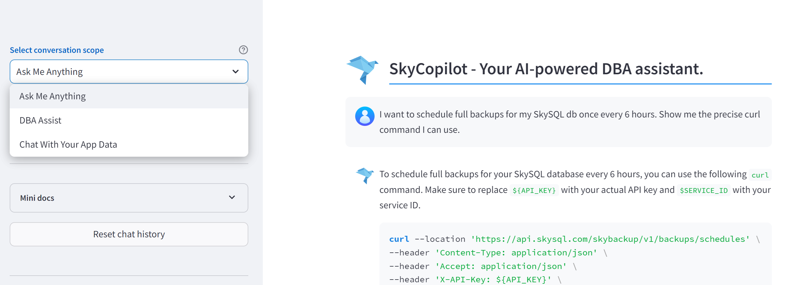
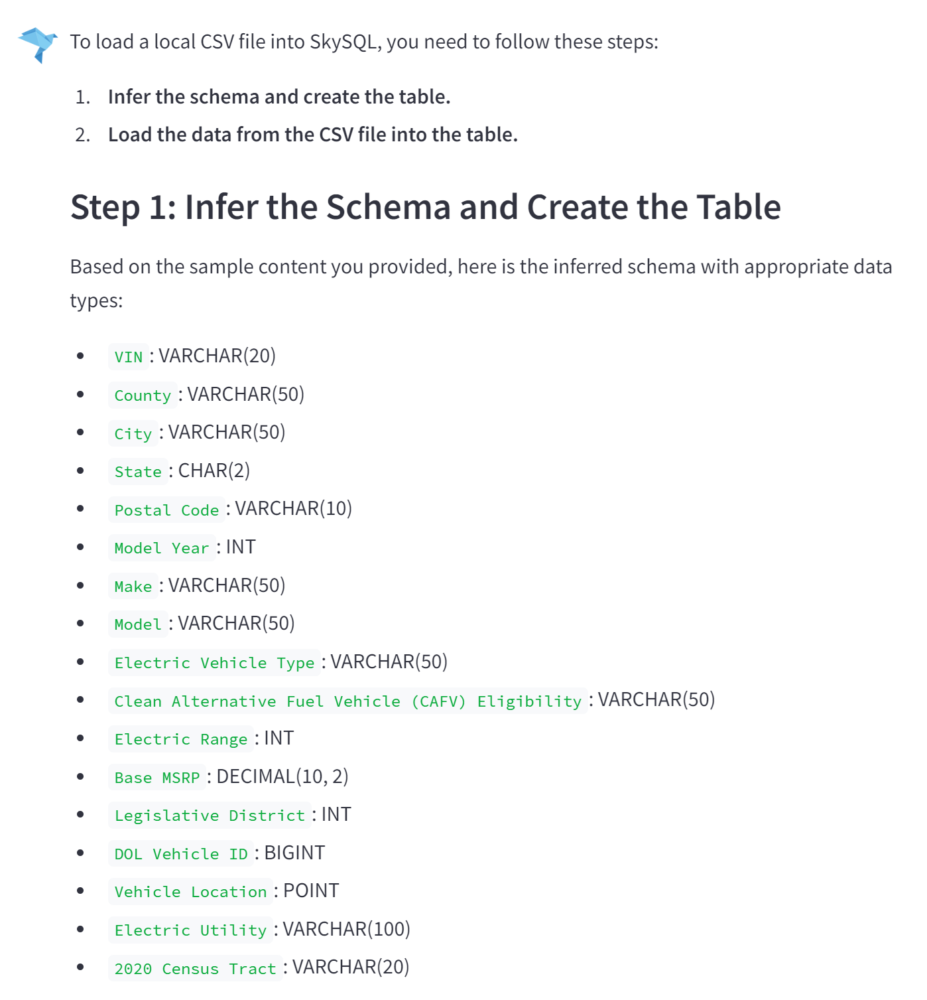
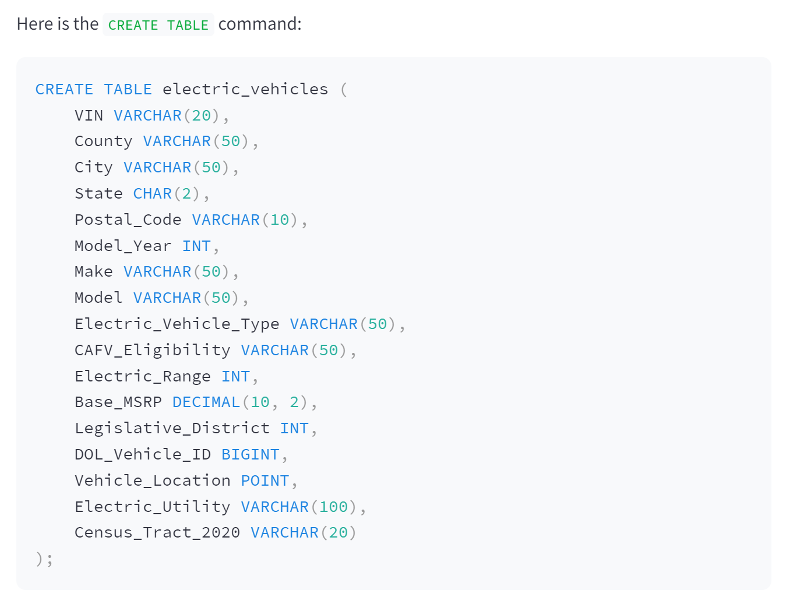
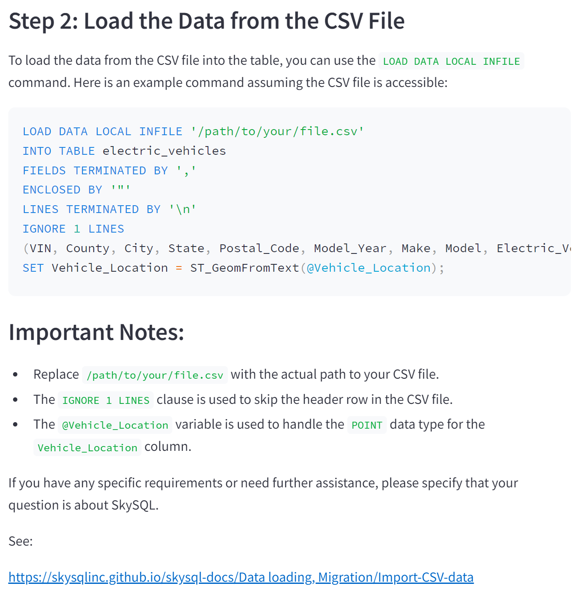
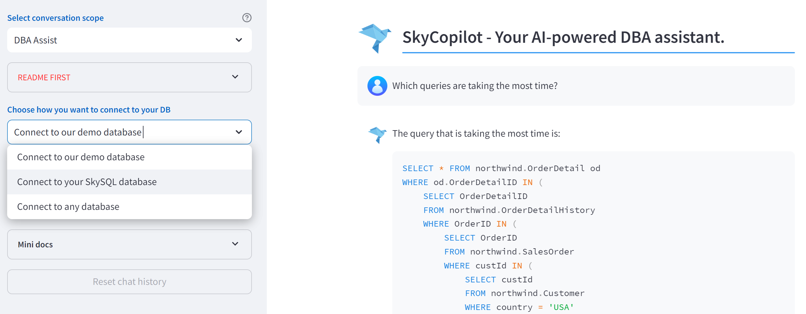
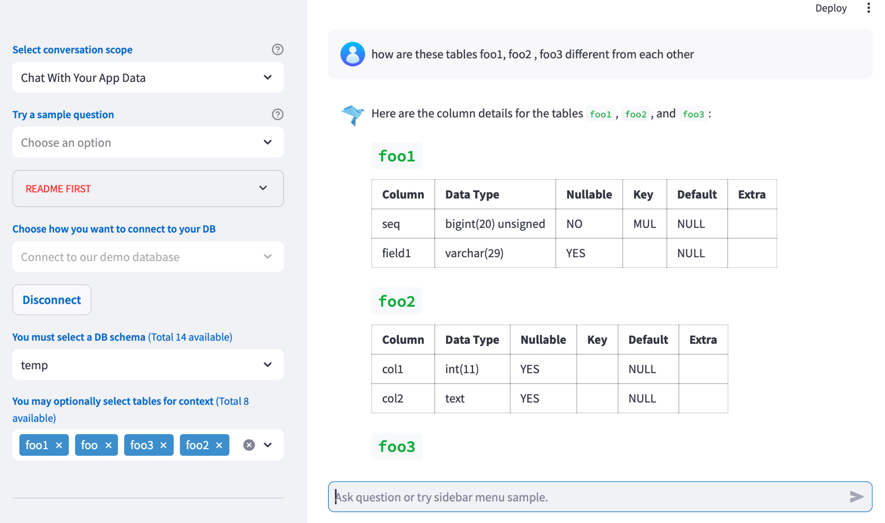

# SkyCopilot User Guide (Tech Preview)

SkyCopilot is a conversational AI tool designed to boost developer and DBA productivity. It can generate complex SQL queries spanning multiple tables, write code to integrate external tools with SkySQL, create MariaDB stored procedures, analyze and optimize slow queries, introspect the vast configuration options or current status of your SkySQL cluster, and much more. SkyCopilot can assist you throughout the entire lifecycle with SkySQL, including development, testing, migration, tuning, and debugging in production. 


It relies on a built-in Vector Database to semantically search SkySQL documentation, AI agents to convert your queries to SQL, and OpenAI's large language model to generate natural language responses. 

!!! Note
    This is currently in Tech Preview. It is Free to use. We may impose usage limits or request you to upgrade to a paid plan as we finalize the product.  

[](quickstart.png)


## Quickstart

SkyCopilot offers 3 conversation modes to choose from:

**1\. Ask Me Anything**

This mode allows you to ask any questions about SkySQL or MariaDB. For SkySQL-specific queries, ensure your question includes the word 'SkySQL'. This mode is best to get answers to conceptual questions about SkySQL or general MariaDB. 

At the moment, this mode does not have access to your database. 
You will notice a dropdown with Sample Questions. These are pre-set questions that you can choose from to get you started. 

Examples:

* *General MariaDB Query:* "What is the default storage engine in SkySQL?"  
* *SkySQL-specific Query:* "Show me a SkySQL program to connect from Java" or "In SkySQL, how can I configure my DB properties?"

!!! Note
    In this mode, you can generate SQL queries or even entire programs, but you have to copy/paste to your app or SQL editor environment to execute. 


**2\. DBA Assist**

Use this mode to ask questions related to system information, tuning, and diagnostics of your databases. Always refer to the README in the Chat for detailed instructions before using this mode.

You will notice a dropdown with Sample Questions. These are pre-set questions that you can choose from to get you started. 

Examples:

* "Analyze the slowest query and provide specific optimization suggestions"
* "How can I optimize the performance of my MariaDB instance?"  
* "What are the recommended configurations for a high-availability setup in SkySQL?"


!!! Note
    This mode is designed to assist DBAs with their routine tasks and troubleshooting. You should go through the README in the Chat to configure your DB for this mode. 


**3\. Chat With Your App Data**

This mode allows you to interact with your application databases securely. Generated SQL queries will be executed safely, providing real-time data insights and actions.

Examples:

   If you connect to the Northwind DB (i.e connect to the Demo Server), you could try out questions like these. 

* "Show me the top 5 customers that placed the most orders."  
* “Show me the total sales revenue per year. Take into account discounts offered.”

!!! Note
    This mode is designed to assist DBAs with their routine tasks and troubleshooting. You should go through the README and the 'Prompt Engg Guide' in the Chat to get the best out of this mode. 


## ‘Ask Me Anything’ Mode

Use this mode when trying to understand MariaDB and SkySQL concepts or features, generate code, perform integration, or manage data migration. In this mode, SkyCopilot relies on the inherent knowledge in OpenAI's large language model about MariaDB and the SkySQL documentation.

It is important to note that while you can generate SQL statements, procedures or other arbitrary code snippets, you have to copy/paste into your app or SQL editor to run the SQL. 

Few 'Best Practices':

* For SkySQL-specific questions, ensure your query includes the word 'SkySQL'.  
* To get the most accurate responses, always do two things:  
  1. Provide sufficient context in your prompts.  
  2. Have a conversation. When a response is provided, nudge with more clarification or corrections. The past discussion automatically becomes context for new questions.

Examples:

1. *General MariaDB Query:* "What is the default storage engine in MariaDB?"  
2. *SkySQL-specific Query:* "Show me a SkySQL program to connect from Java" or "In SkySQL, how can I configure my DB properties?"  
3. *CSV Loading Example:* _"I need to load a local CSV file into SkySQL. Below is sample content in the file. I need you to infer the schema with correct data types, show me the create table command, and then commands to load the data."_  
```
VIN,County,City,State,Postal Code,Model Year,Make,Model,Electric Vehicle Type,Clean Alternative Fuel Vehicle (CAFV) Eligibility,Electric Range,Base MSRP,Legislative District,DOL Vehicle ID,Vehicle Location,Electric Utility,2020 Census Tract  
1N4AZ0CP5D,Kitsap,Bremerton,WA,98310,2013,NISSAN,LEAF,Battery Electric Vehicle (BEV),
Clean Alternative Fuel Vehicle Eligible,75,0,23,214384901,POINT (-122.61136499999998 47.575195000000065), ...
```

This will produce results like this … 

[](ama1.png)
[](ama2.png)
[](ama3.png)


## ‘DBA Assist’ mode

Use this mode to ask questions related to system information, tuning, and diagnostics of your databases. This mode uses the built-in system tables and meta data to answer questions. 

Questions are decomposed into one or more steps and each step is typically converted to a SQL statement on one or more system tables (tables/views in information\_schema, mysql, performance schemas) and executed. 

**Prerequisites:**

* The easiest way to try things out is to use our Demo DB Server. It is a single server with sample data and some slow queries logged.  
* You can start with some of the sample questions available in the SkyCopilot UI.   
* Alternatively, you can connect to any MariaDB running on SkySQL or elsewhere. This way, you can try with your own workloads. Note the following:  
  -- The DB user needs some privileges as noted below. Rest assured, SkyCopilot does not require any write privileges to your schemas.  
  -- We recommend starting with Development/Test DBs first.  
  -- Grant the DB user permissions required for DBA Assistance ...

```sql
CREATE USER IF NOT EXISTS 'skyai'@'%' IDENTIFIED BY 'a\_secure\_password';  
GRANT SELECT, PROCESS, SHOW VIEW, SHOW DATABASES ON \*.\* TO \`skyai\`@\`%\` ;  
GRANT CREATE, DROP, CREATE VIEW ON \`sky\_sys\_catalog\`.\* TO \`skyai\`@\`%\` ;
```

* Assuming you want to analyze slow queries, you need to turn on 'Slow query' logging. The slow\_log overhead is proportional to the amount of queries logged. It is recommended you start with a high slow\_query\_time, implement a log\_slow\_rate\_limit, and disable logging when not in use.  
  -- If using SkySQL, go to [Config Manager](https://app.skysql.com/settings/configuration-manager) to see all the current configuration templates. If you are just using the default one ("SkySQL Default \- Enterprise Server..."), click the 'Create New' button, and change the following settings:  
2. Change 'slow\_query\_log' to ON.  
3. Change 'log\_output' to TABLE (defaults to FILE).  
4. Adjust the 'long\_query\_time' if required (Defaults to 10 secs). If set too low you could substantially increase the load. You can check the global status variable [slow\_queries](https://mariadb.com/kb/en/server-status-variables/\#slow\_queries) to tune the long\_query\_time.

It is also useful to turn ON 'Performance\_schema' (though, note that this option will restart your DB service and does introduce between 1-10% overhead so implementation should be tested/tuned for best practice).

**Connect to your DB server or cluster:**

Once you have followed the above steps you have to connect to a DB server to start using this mode. 

[](dba1.png)

**Sample questions:**

The following sample questions are also accessible in the dropdown menu on the left pane. This shows up once you have a successful connection to the DB. 

* Which queries are taking the most time?  
* Analyze the slowest query and provide details on where the time is spent.  
* Analyze the slowest query and provide specific optimization suggestions.  
* Show me all currently running queries.  
* Provide a report on the health of my server.  
* Which users have been the most active?  
* Analyze the state of my InnoDB storage engine. Any insights?  
* How many threads are active and what is the maximum allowed?

**Scope of understanding:**

The AI assistant answers all the questions using system tables in the “information\_schema” and “mysql” schemas primarily. It will also attempt to answer questions using the “sys” and “performance\_schema” schemas \- if “perf\_schema” is turned ON. 

We currently provide contextual information to the LLM from system schemas. We provide a lot more details on a few specific tables \- information\_schema.tables, mysql.slow\_log, information\_schema.global\_variables and global\_status, process\_list, and the events\_statements\_history tables. 

Often your questions will result in a sequence of SQL statements being executed. You will always see the actual SQL statements being used in the `sql` tab in the response. Sometimes your question doesn’t require any SQL execution (e.g. `explain how MariaDB implements row level locking`)  and we will try to provide the best possible answer using the foundational knowledge in OpenAI’s GPT models about MySQL and MariaDB.

!!!Note
    We use OpenAI’s LLM to only generate SQL or provide informational content. We always execute these statements in the secure SkySQL environment.

It is important to note that the **current implementation does not have any access to historical metrics** (outside of what is available and logged to “slow\_query” and the “performance\_schema” tables), file system (for example, it cannot assess the percentage of disk that is consumed by data or indexes or cannot access error or general logs).

## ‘Chat with your App Data’ mode

This mode allows you to interact with your application databases securely. Generated SQL queries will be executed safely, providing real-time data insights and actions.

Before you can start chatting, you must first connect and select a DB schema to operate on. 

* *Step 1*: Connect to a DB service. The demo server has schemas like the [Microsoft Northwind DB](https://support.microsoft.com/en-us/office/northwind-database-diagram-cd422d47-e4e3-4819-8100-cdae6aaa0857).  
* *Step 2*: Select the DB schema to operate on. Currently we only support one DB schema at a time. We intend to support multiple schemas in the future.   
* *Step 3*: Select the Tables for more selective context.   
  * To get higher accuracy, when your schema has many tables (even if it is just \> 10\) you should select just the few tables you need. 

[](app1.png)

## Getting accurate answers requires some discipline

You should always start with a specific task or goal in mind (e.g. you want to start a chat session to analyze sales orders as opposed to trying to get a view on customer shipments in an Order processing system). 

Real world production databases are often complex \- hundreds of tables, complex and hidden relationships, obtuse column names with no discernable semantics, many dimensions with coded values and so on. By default, when you select your schema we gather all the metadata available in the DB \- column names, data types, constraints, table/column descriptions and index all this information (in a vector store). When you pose a question, the engine will extract just the relevant bits from this context and pass it along to the LLM. As you can appreciate, this will not capture a lot of the other knowledge required to train our AI engine to produce good results. 

To significantly increase the accuracy of the results, we recommend you add the additional context using Table and Column descriptions. Please follow through the steps outlined in the [**Prompt Engg Guide**](https://skysql.notion.site/Sky-Copilot-Prompt-Engg-Guide-fc2971f5162b421588c9750e7b147d5e?pvs=73) for examples and best practices. We intend to make the process of “training” a lot more simpler using other AI smarts in the near future. 

!!! Note
    1) **Guardrails** \- We have guardrails implemented to prevent any undesired SQL injection. Only ‘Select’ statements can ever be executed on your DB and all statements, by default, will never fetch more than a 100 rows. To prevent any aggregation class query to over consume resources, any query taking more than 30 seconds will be canceled.   
    2) **Lazy Indexing** \- We lazily index (i.e. add to Vector DB) all the table metadata, descriptions when you ask your first question, after selections. The time taken to index is proportional on the number of tables selected.   
    3) **SQL Generation** \- Your questions are translated into one or more SQL queries using only the table schema information. The SQL queries are always executed in the secure SkySQL environment only. 


## Connecting to your Database

SkyCopilot provides 3 different DB connection target types: a demo server, your SkySQL services, and also any MariaDB server outside SkySQL.

### Connect to our demo database

This is the easiest way to explore the SkyCopilot functionalities. Just click on the “Connect” button, try a sample question and just continue the conversation. Our demo database is populated with the [Microsoft Northwind](https://support.microsoft.com/en-us/office/northwind-database-diagram-cd422d47-e4e3-4819-8100-cdae6aaa0857) dataset.

### Connect to your SkySQL database

SkyCopilot attempts to connect to your SkySQL service using the default credentials set up during the service creation and displayed in the SkySQL portal. If the user is removed or the password changed you only need to provide a user with sufficient grants (as noted in the DBA-assist section), the service hostname and port are automatically obtained from the SkySQL APIs. 

### Connect to any database

You are also able to profit from the SkyCopilot functionalities using any MariaDB server outside SkySQL. You just need to make sure that you provide a user with sufficient grants for your database (as noted in the DBA-assist section) and allow the SkyCopilot IP address displayed above the form with the DB details inputs.

## How does it work? 

Within each service you launch in SkySQL, we create an "AI" user that is provided privileges to access the system tables and also run SELECT queries on your DBs but is not granted any privileges that can result in data changes \- CREATE, DROP, UPDATE, INSERT, etc., are not granted. This prevents "SQL injection" related problems. The AI user also uses an internal schema with enough "VIEW" definitions for simpler access to the system views. The current design uses what is referred to as "Agentic RAG" \-- LLM agents with "Retrieval Augmented Generation". 

**Here is how this works, in brief:** The AI engine statically consumes our knowledge base along with the schema metadata for all the system tables and indexes all this information into a Vector DB (as embeddings). Each user request (question) is first converted into "embeddings" (think of embedding as a digital representation to fully understand your question). This is then used to retrieve appropriate context using similarity searches from the Vector Database. For instance, a question like "how is my buffer cache utilization" could result in extracting information on commands like "show engine innodb status" or "global status variables" from the Vector DB. This information is then passed to OpenAI's LLM to construct valid MariaDB SQL that can be executed by us. We often pass these results back to OpenAI LLM to synthesize more meaningful answers for the user. Now, this above description is a simplified version of what happens under the covers. In reality, we use an agent that is first handed the question. The agent uses a "reasoning" loop to often break down the question and uses underlying tools we provide to execute the desired action.
