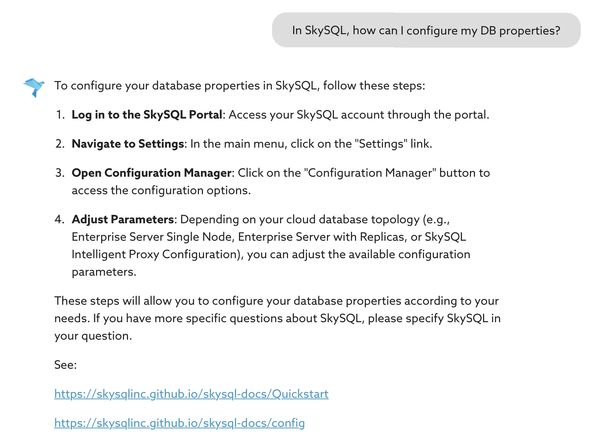
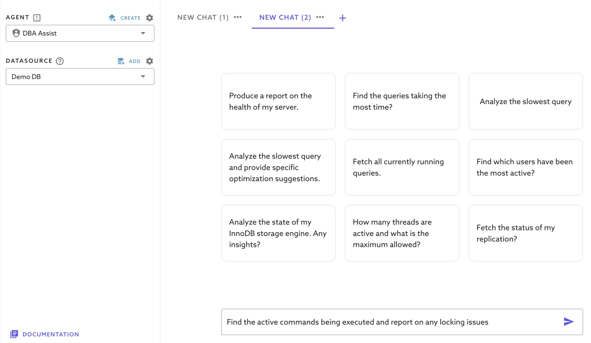
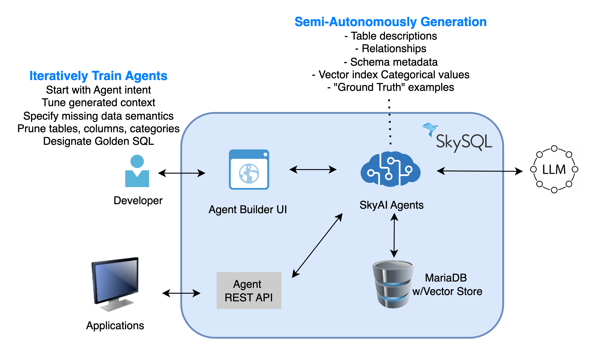

# SkyAI AI Agent User Guide (Tech Preview)

!!! Note
    - This capability is currently in Tech Preview.
    - Documentation is terse and incomplete.
    - Currently it is free to use.We provide upto a million tokens of free usage per month per account. If you exhaust your tokens and need more, please feel free to reach us at info@skysql.com.
    - Our "free usage" policy is subject to change as we finalize the product.
    
We appreciate your feedback and suggestions. You can reach us at **[info@skysql.com](mailto:info@skysql.com) or [support@skysql.com](mailto:support@skysql.com)**


SkySQL offers two types of SkyAI Agents: 

* **Built-in Agents**: These are preconfigured agents designed to help developers and DBAs maximize the value of SkySQL. Currently we have two agents: Developer Copilot and DBA Copilot. They assist users in answering questions about MySQL, MariaDB, and SkySQL, and are tailored to enhance user productivity.

* **User-Created Custom Agents**: These allow users to query complex databases using natural language with high accuracy, consistency, and ease.

---
## Built-in Agents

### 1) Developer Copilot **Agent for SQL Developers**

This agent functions much like modern copilot tools but is specifically tailored for **SkySQL** and **MariaDB**. It allows developers to interact with the database using natural language queries, enabling them to quickly find solutions without needing to dive deep into documentation or use SQL editing tools.

You can ask a wide range of questions, such as:

- **General MariaDB Queries**:
    - *"What is the default storage engine in SkySQL?"*
- **SkySQL-Specific Queries**:
    - *"Show me a SkySQL program to connect from Java."*
    - *"In SkySQL, how can I configure my DB properties?"*

Additionally, the agent can generate complex SQL queries spanning multiple tables, create schemas, write integration code, and even assist with tasks like generating stored procedures or loading data. This agent is trained using the **SkySQL documentation** and leverages the **OpenAI LLM's prior knowledge** to provide accurate, context-aware responses.

#### Example of the Developer Copilot in action:


### 2) **DBA Copilot Agent**

The DBA Copilot is a specialized agent that helps DBAs with **system information**, **tuning**, and **diagnostics**. It taps directly into **SkySQL's built-in system tables** and **metadata** to answer queries about the database's internal state.

When a user asks a question, it breaks the query down into discrete steps, each of which typically gets translated into a **SQL statement** targeting system tables such as those in `information_schema`, `mysql`, or `performance_schema`. These steps are executed to fetch relevant data and provide actionable insights, making it easier for DBAs to monitor and optimize database performance.

#### Example of the DBA Copilot in action:


### **Important information** 

The simplest way to get started is by using our Demo DB in the "DataSource" drop down. It features a standalone MariaDB server preloaded with sample data and includes logged slow queries for testing.

You can begin by exploring some of the sample questions provided below. Alternatively, connect to any MariaDB server running on SkySQL or another platform to experiment with your own workloads.


**Note the following:**

If you are using your own database, we recommend starting with Development/Test DBs first.

The DB user used by DBA Copilot needs the privileges as noted below.
Create the following user and grant the privileges as shown below. Please note, Copilot doesn't require write privileges to your schema. 

```sql
CREATE USER IF NOT EXISTS 'skyai'@'%' IDENTIFIED BY 'some_compliant_password';

GRANT SELECT, PROCESS, SHOW VIEW, SHOW DATABASES ON *.* TO `skyai`@`%`;

GRANT CREATE, DROP, CREATE VIEW ON `sky_sys_catalog`.* TO `skyai`@`%`;
```

These SQL statements:

1. Create a new user named 'skyai' that can connect from any host ('%')
2. Grant read-only privileges plus some system-level viewing permissions on all databases
3. Grant create/drop privileges specifically on the sky_sys_catalog database

Remember to replace 'some_compliant_password' with a secure password of your choice.

**SlowQuery analysis**

To analyze slow queries, you need to turn on 'Slow query' logging. The slow_log overhead is proportional to the amount of queries logged. 

It is recommended you start with a high slow_query_time, implement a log_slow_rate_limit, and disable logging when not in use.

If using SkySQL, go to Config Manager to see all the current configuration templates. If you are using the default config("SkySQL Default - Enterprise Server..."), click the 'Create New' button, and change the following settings:

1. Change 'slow_query_log' to ON.
Change 'log_output' to TABLE (defaults to FILE).
2. Adjust the 'long_query_time' if required (Defaults to 10 secs).

    Caution: If 'long_query_time' is set too low you could substantially increase the load. You can check the global status variable slow_queries to tune the long_query_time.

**Performance Schema**

It is also useful to turn ON 'Performance_schema' (Note that this option will restart your DB service and does introduce between 1-10% overhead so implementation should be tested/tuned for best practice).


## User created custom agents.

**Why Traditional Solutions Fall Short**

* Complex database schemas with multiple layers and relationships.
* Ambiguous terminology and hidden business rules.
* Inconsistent data that makes standard AI models inaccurate.

A common approach, *Agentic Retrieval-Augmented Generation (RAG)*, requires extensive data integration and maintenance, making it resource-intensive.

### **Semi-Autonomous, No-Code Semantic DB Agents**

SkySQL includes a **No-Code Agent Builder**. This tool empowers domain experts to define the missing semantics critical for accurate responses without requiring programming expertise. The system then leverages the database's metadata—such as table definitions, constraints, and relationships—and learns from historical queries to train the Agent.

However, automation alone isn't enough. Real-world databases often contain hundreds of tables with cryptic naming conventions, impure data, and hidden rules. This is where the **human-in-the-loop** design becomes essential. SkySQL engages the user interactively through a wizard-like interface that:

1. Proposes relevant tables and dimensions based on the Agent's intent.
2. Analyzes data to compute initial semantic descriptions for columns and tables.
3. Allows the user to iteratively refine these semantics.

Users validate and train the Agent by asking questions, inspecting the generated SQL, and tagging "golden SQL" queries that serve as the ground truth. This iterative process ensures the Agent's outputs are both accurate and contextually relevant.

Under the hood, SkySQL handles:

* **Vector Indexing** of DB metadata, high-cardinality text columns, and golden SQL to enable efficient semantic searches.
* **Automatic Orchestration** of the RAG pipeline, reducing the need for external integrations and securing all AI interactions.
* **Online Evaluation** of the results for accuracy - when dealing with complexity, incomplete guidance or semantics the responses can be inaccurate.  It is important for users or a consuming application to know the quality of the response. We use a "LLM as Judge" approach to provide a confidence and correctness score that is biased against providing false positives. The evaluator is designed to assign lower confidence for uncertain responses rather than risk assigning high confidence to incorrect ones. This approach ensures trustworthy results.

Once trained, the Agent can be consumed via a simple REST API that supports:

* Stateful **Chat Sessions**.
* On-demand **Natural Language Queries**.
* Advanced **Semantic Searches (*coming in the near future*)**.

#### Sky Semantic Agents Architecture


## Creating a task specific Semantic Age

### Step 1: Define the Data Source

Ensure you have a clearly defined data source. In this guide, we use the IMDB database in the DemoDB, which contains information on movies, actors, directors, genres, and ratings.

###  Step 2: Define the Agent's Intent

Clearly outline the intent for your agent and its purpose. Provide enough details in the  description to guide agent creation process. 

Example intent:

The IMDb AI Agent enables users to explore complex queries about movies, actors, directors, roles, and genres with precision and ease. Designed to generate accurate SQL queries, it provides insights into movie details, filmographies, collaborations, character archetypes, genre trends, and rankings.

This ensures the agent is created with enough context to respond within its designated scope.

### Step 3: Selecting Relevant Tables and overcoming schema complexities

The IMDB database contains many tables, but only a subset is necessary for our queries. The agent automatically selects relevant tables based on intent and assigns context to each.

**Adjusting Table Selection**

Review the AI's selections and refine if needed.

Remove unrelated tables to streamline queries.

### Step 4: Pruning Unnecessary Columns


Once relevant tables are selected, we refine them further by pruning unnecessary columns. This step is critical in enhancing the efficiency of the agent and ensuring optimal performance.

**Why Pruning Columns is Important**

**Reduces data processing overhead:** The fewer columns included in queries, the less data the system needs to process, leading to faster execution times and reduced computational load.

Optimizes LLM token usage: Large language models (LLMs) have token limits. Including unnecessary columns increases token consumption, which can degrade performance and inflate costs.

Focuses the agent on essential attributes: Keeping only the necessary columns ensures the agent provides accurate results while avoiding irrelevant data that could introduce noise or inaccuracies in query generation.

How to Prune Unnecessary Columns:

Identify Core Columns – Determine which columns contain critical information for answering relevant queries. These may include primary keys, foreign keys, and commonly queried attributes (e.g., movie_title, release_year, rating).

Eliminate Redundant Data – Remove columns with repeated or derived data that can be computed from other fields (e.g., if full_name is stored separately as first_name and last_name, one format may be redundant).

Exclude Irrelevant Fields – Drop columns that do not contribute to the agent's core intent. For example, if the goal is to generate movie-related SQL queries, fields like internal_notes or marketing_campaign_id may not be necessary.

Optimize for Query Performance – Retaining only essential columns improves database indexing and query execution speeds, particularly for large datasets.

By following this structured pruning approach, we ensure the agent remains efficient, cost-effective, and highly accurate in generating SQL queries.

### Step 5: Ensuring Essential Categorical Columns

Categorical columns provide context for structured data. For example, in IMDB:

Genre (Comedy, Western, Horror, etc.)

Role Type (Lead, Supporting, Cameo)

These are indexed automatically for efficient query generation.


### Step 6: Testing and refining by running Sample Queries

Once schema refinement is complete, test the agent using structured queries:

Simple Query: *"Find the highest-rated movies of all time"*.

Complex Query: *"Find the top 10 actors who played a pirate, ranked by number of movies."*"

Monitor outputs and fine-tune table/column context as necessary.

### Step 7: Establishing 'Golden SQL' Benchmarks

Golden SQL queries serve as accuracy benchmarks. When an agent consistently generates correct SQL for a given prompt, it is marked as Golden SQL, ensuring future queries follow the same logic.


Your trained agent is now ready for deployment—capable of transforming natural language queries into efficient SQL with high accuracy.


# Deploying and Using the Agent
## Testing in a Conversational App

Once trained, test the agent in a live environment. Example:

User Input: *"Find the highest-rated movie starring Clint Eastwood from the 1980s"*.

Agent Process: Identifies relevant tables (movies, actors, ratings), constructs a JOIN operation, and filters data based on the criteria.


# Understanding Query Mechanics

The agent uses semantic search to interpret user intent.

For example, when asked:

*"Find the top 10 actors who played a pirate"*.

The agent:

Identifies 'pirate' as a character archetype.

Joins actor, character, and movie tables.

Filters results based on role counts.

This structured approach ensures high-accuracy SQL generation.


